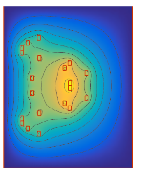

X_MINMAX1 =  [14.648894105609035, 5.36700024240791, 24.231700785121845, 8.0784214322869, 12.136589144584885, 17.239039787160376, 18.45348605305637, 15.457659788832702, 14.89771441651926, 20.0446298580020];
costs:[0.4117744027820353, 1.7477270642623228]

#result = error_estimation(X_MINMAX1, c_base = 20 * [3.0], is_current=False, is_optimization=False,doe_method=DoEType.PB)
#print(result)
# Minmax without current f_1 [%]:  0.41177440277967176 f_2 [%] 1.7477270642688498
# Minmax with current    f_1 [%]:  0.41177440278051747 f_2 [%] 3.4503854220533245
# PB with current     f_1 [%]:  0.4117744027792381 f_2 [%] 4.052060290632767
# PB without current     f_1 [%]:  0.4117744027778069 f_2 [%] 2.0494507070565464

X_MINMAX2 = [9.642648902292361, 5.282069784346017, 24.537841778121283, 8.059349224813, 12.318525759009816, 15.019686958780929, 18.63674172150556, 15.770361021866993, 14.876436429127999, 20.0443749044710];
#costs:[0.9035269365144892, 1.50332356458337]

#result = error_estimation(X_MINMAX2, c_base = 20 * [3.0], is_current=True, is_optimization=False,doe_method=DoEType.MINMAX)
#print(result)

# PB without current ---  f_1 [%]:  0.903526936517048  f_2 [%] 2.322607440380917
# PB with current    ---  f_1 [%]:  0.9035269365172648 f_2 [%] 4.33851862275213
# Minmax with current --- f_1 [%]: 0.9035269365128196 f_2 [%] 3.1298760562339587

X_MINMAX3 = [10.36, 6.98, 5.2, 5.16, 10.49, 19.95, 18.38, 25.16, 8.25, 20.03];
costs:[4.963, 0.08053]

