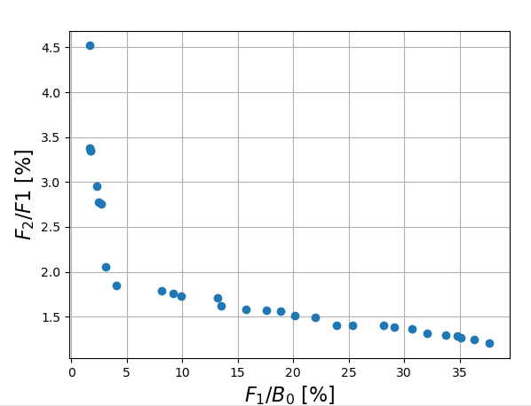
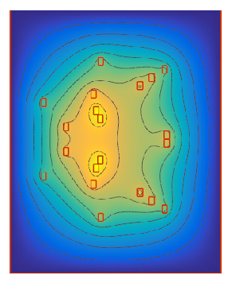
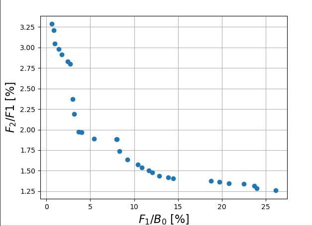
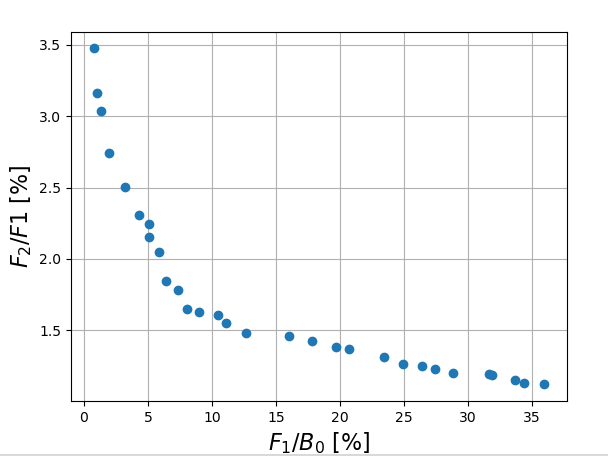
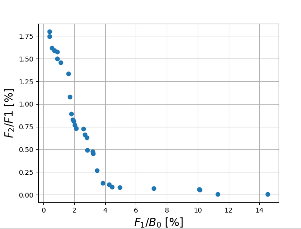
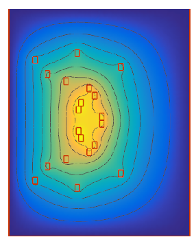

# Resulting Pareto fronts for 3 differen cases

### I) Plackett-Burmann Design based error metric with current error considerations

Optimization settings:

Population number = 30
Number of generations = 30

Pareto values after the iteration:

| $f_1/B_0$ [%] | $f_2/B_0$ [%] |
|---------------|---------------|
| 1.6174        | 4.5204        |
| 1.6423        | 3.3800        |
| 1.7098        | 3.3500        |
| 1.7124        | 3.3475        |
| 2.3279        | 2.9580        |
| 2.4731        | 2.7760        |
| 2.7136        | 2.7594        |
| 3.0631        | 2.0526        |
| 4.0873        | 1.8505        |
| 8.1481        | 1.7885        |
| 9.1465        | 1.7635        |
| 9.8946        | 1.7246        |
| 13.1945       | 1.7138        |
| 13.4715       | 1.6230        |
| 15.7591       | 1.5824        |
| 17.5552       | 1.5756        |
| 18.8528       | 1.5614        |
| 20.1081       | 1.5096        |
| 21.9565       | 1.4910        |
| 23.9214       | 1.4084        |
| 25.3214       | 1.3993        |
| 28.1454       | 1.3987        |
| 29.0787       | 1.3814        |
| 30.7262       | 1.3677        |
| 32.0910       | 1.3188        |
| 33.7677       | 1.2957        |
| 34.7978       | 1.2803        |
| 35.1497       | 1.2617        |
| 36.3384       | 1.2415        |
| 37.7097       | 1.2021        |

Selected cases:

### I - High uniformity and low robustness

$f_1 / B_0$ [%] = 1.617

$f_2 / B_0$ [%] = 4.52

Solution vector:

x = [15.23, 28.82, 26.92, 15.85, 15.32, 6.03, 22.24, 16.70, 10.11, 29.07]

### II - Balanced solution

$f_1 / B_0$ [%] = 2.7135

$f_2 / B_0$ [%] = 2.7593

x = [16.67, 28.82, 26.34, 24.15, 15.32, 5.87, 15.79, 16.62, 10.11, 29.23]

### III - Low uniformity and high robustness

$f_1 / B_0$ [%] = 18.85

$f_2 / B_0$ [%] = 1.56

Solution vector: 

x = [28.21, 27.91, 24.67, 15.79, 11.82, 14.16, 14.67, 23.98, 28.49, 25.37]

## II Plackett Burman without currents

Pareto - values after the last iteration:

| f_1     | f_2    |
|---------|--------|
| 0.5754  | 3.2860 |
| 0.8457  | 3.2087 |
| 0.9682  | 3.0450 |
| 1.4101  | 2.9823 |
| 1.7103  | 2.9159 |
| 2.4428  | 2.8312 |
| 2.7186  | 2.8012 |
| 2.9603  | 2.3735 |
| 3.1738  | 2.1903 |
| 3.6542  | 1.9702 |
| 3.9875  | 1.9644 |
| 5.4533  | 1.8891 |
| 7.9706  | 1.8854 |
| 8.0663  | 1.8845 |
| 8.3392  | 1.7378 |
| 9.2478  | 1.6361 |
| 10.4438 | 1.5751 |
| 10.8665 | 1.5387 |
| 11.6605 | 1.5043 |
| 12.0691 | 1.4756 |
| 12.8649 | 1.4364 |
| 13.8936 | 1.4180 |
| 14.4552 | 1.4089 |
| 18.7592 | 1.3771 |
| 19.7553 | 1.3660 |
| 20.8154 | 1.3453 |
| 22.5113 | 1.3384 |
| 23.6889 | 1.3130 |
| 23.9729 | 1.2839 |
| 26.1746 | 1.2586 |

vector: [5.212903061265558, 7.805896907909365, 13.136408320461342, 12.648260889894708, 10.924066864374337, 14.12696587958578, 22.727923848489, 18.2752262204133, 15.71045409964621, 18.18145515425929];
costs:[1.4101090365250744, 2.982313270766127]
team35-doe-app-1:
team35-doe-app-1:
vector: [7.534187948102544, 8.183588408697116, 15.602361369877418, 10.515483408235324, 14.653737016757491, 6.348128637589274, 24.049754170686246, 25.834516597397194, 29.70520021912213, 9.0806733415439];
costs:[3.654193327308052, 1.9701579121279476]
team35-doe-app-1:
team35-doe-app-1:
vector: [7.509461702577492, 8.2019895136727, 13.172821431059061, 11.620196904049417, 9.60826414766745, 18.09094482304079, 22.727923848489, 18.083460423459876, 15.71045409964621, 17.84405542750670];
costs:[2.4428479096804607, 2.8311954565023534]
team35-doe-app-1:
team35-doe-app-1:
vector: [7.508752102952521, 7.713634823057748, 12.201617649384588, 10.964807755457132, 16.269424655056376, 17.949454397964395, 22.727923848489, 17.427884333722048, 13.896725766674848, 18.01358856280050];
costs:[0.8457491257855918, 3.208662420426257]
team35-doe-app-1:
team35-doe-app-1:
vector: [7.508752102952521, 8.027806098321827, 8.796935952998208, 11.417176076705703, 14.993361250739747, 17.949454397964395, 22.727923848489, 17.427884333722048, 13.83038094201176, 18.01358856280050];
costs:[0.9682138007967473, 3.045041097040648]
team35-doe-app-1:
team35-doe-app-1:
vector: [7.153358722360702, 8.171932313502342, 11.645956122603243, 12.603369609935283, 27.81889386673576, 5.272092501078965, 24.262485675993595, 25.81751505041401, 16.230700909035324, 21.79518138704519];
costs:[22.511293920313754, 1.3383691447661012]
team35-doe-app-1:
team35-doe-app-1:
vector: [7.46261313780755, 7.955135595061302, 12.014474204947806, 10.760163435082328, 15.264510500737774, 5.554538653161395, 24.400711077559198, 20.348847762861517, 16.22513827856898, 17.6831772915650];
costs:[9.247770556681697, 1.636111587134518]
team35-doe-app-1:
team35-doe-app-1:
vector: [7.152533258242202, 7.724249311544147, 11.63574147321036, 12.603369609935283, 28.193464044857212, 5.272092501078965, 24.67067602758966, 27.13242575399339, 16.230700909035324, 21.79518138704519];
costs:[23.972871131951113, 1.283940195170928]
team35-doe-app-1:
team35-doe-app-1:
vector: [7.739622058425617, 7.784072407263741, 11.914456042098136, 10.818028241950616, 15.80388927361312, 6.360251560473281, 24.221284293053102, 16.875143149591207, 16.17767229074622, 21.5582313411227];
costs:[8.339154628785007, 1.7377887976215514]
team35-doe-app-1:
team35-doe-app-1:
vector: [6.3396273256608655, 8.723263860228963, 11.913683589001034, 12.756169578365679, 19.558256374152748, 5.338428965620478, 26.33342927594133, 18.51764682118697, 28.06262833372568, 18.23170793805289];
costs:[20.81535299600453, 1.3452713042310696]
team35-doe-app-1:
team35-doe-app-1:
vector: [7.1551659067102635, 7.728694487271027, 11.916783646504935, 10.818028241950616, 15.836356860477107, 5.272477319608565, 24.26249702511317, 16.843605442043348, 15.519901352388803, 22.07585723796876];
costs:[10.443754622705445, 1.5751035244355438]
team35-doe-app-1:
team35-doe-app-1:
vector: [7.521327172790934, 8.045601138585392, 15.463155945088767, 10.595568619008455, 14.951840124630973, 6.348643162074493, 24.419477723334396, 25.834516597397194, 29.628241494648666, 9.0806733415439];
costs:[3.9874844744150026, 1.9643993898612353]
team35-doe-app-1:
team35-doe-app-1:
vector: [7.522201445114691, 7.804969044720849, 12.103411586278627, 12.598762590233097, 17.23032806404739, 5.290741607277371, 24.194464504888803, 18.660674526026455, 15.71045409964621, 17.84477131808445];
costs:[7.970616715416, 1.8853847939074737]
team35-doe-app-1:
team35-doe-app-1:
vector: [6.391032283842455, 8.725284139115201, 11.914492904249945, 12.588152363330533, 19.558256374152748, 5.336382932391542, 24.472836436030466, 18.517772872092184, 28.06262833372568, 18.23170793805289];
costs:[19.755349220006135, 1.3659843216095213]
team35-doe-app-1:
team35-doe-app-1:
vector: [6.365397868395061, 8.715499191662888, 11.913398254678134, 6.396764232244982, 19.558256374152748, 7.037734085461387, 26.33342927594133, 18.51764682118697, 13.616133744447303, 18.23170793805289];
costs:[8.06629171791291, 1.8844591122520788]
team35-doe-app-1:
team35-doe-app-1:
vector: [7.110146358496619, 7.805031262176417, 12.01836380446628, 10.753787461424738, 15.303972613495166, 5.558439144262049, 24.196531472279435, 20.338048406450557, 15.632365647923352, 17.6775169190382];
costs:[8.615775269053804, 1.6818003879710612]
team35-doe-app-1:
team35-doe-app-1:
vector: [5.1445700624591435, 8.174179149898263, 11.658125646910117, 12.540070668211525, 27.81889386673576, 5.272058534869634, 24.245410058393258, 25.81751505041401, 16.230700909035324, 22.047593011081];
costs:[23.688862788960552, 1.3130071009607351]
team35-doe-app-1:
team35-doe-app-1:
vector: [7.519679267218959, 5.615243209214987, 13.687354214869943, 5.763002705286745, 19.607843543662053, 5.233367474693156, 23.826927370030656, 17.404215726583324, 16.222236420764585, 17.6620060921808];
costs:[13.893632216267674, 1.4179992408023612]
team35-doe-app-1:
team35-doe-app-1:
vector: [6.4185817179885, 8.177318815424927, 13.687354214869943, 5.492608175839443, 19.574061666378316, 5.233367474693156, 22.15126301434204, 17.980287950524634, 16.624774912479385, 17.44958026148704];
costs:[12.864926013531855, 1.4363571082635809]
team35-doe-app-1:
team35-doe-app-1:
vector: [6.393129031303251, 8.177318815424927, 13.687354214869943, 5.492608175839443, 19.574061666378316, 5.233367474693156, 22.15126301434204, 17.217334050130084, 16.624774912479385, 17.44958026148704];
costs:[12.160840130721093, 1.481886357421441]
team35-doe-app-1:
team35-doe-app-1:
vector: [7.7355570194051655, 7.734080989193611, 11.914456042098136, 10.818028241950616, 15.80388927361312, 5.136865848550178, 24.221284293053102, 16.869410104609994, 16.17767229074622, 21.5582313411227];
costs:[10.866482187408764, 1.538719426009288]
team35-doe-app-1:
team35-doe-app-1:
vector: [7.180618593394952, 7.728694487271027, 11.916783646504935, 10.592900782312022, 15.836356860477107, 5.272477319608565, 23.843976067683638, 17.618014827282835, 16.02779508094444, 22.03615835186145];
costs:[11.660518441700065, 1.5043069699426093]
team35-doe-app-1:
team35-doe-app-1:
vector: [7.508752102952521, 8.02477767776475, 12.207771237479012, 10.858294045917717, 16.269424655056376, 17.949454397964395, 22.727923848489, 17.427884333722048, 13.83038094201176, 18.01358856280050];
costs:[0.5754308098203592, 3.2859912835390275]
team35-doe-app-1:
team35-doe-app-1:
vector: [7.547747885802801, 8.185826700774626, 11.632790151288443, 14.74562575546206, 26.36190305610094, 5.502778156247715, 23.097906248995947, 25.315557937276992, 27.673680985299494, 18.22791657510532];
costs:[26.17460510559188, 1.2586471342625605]
team35-doe-app-1:
team35-doe-app-1:
vector: [7.533814984289678, 8.045601138585392, 15.583951265436287, 11.653797536715444, 14.901547712971276, 6.750872765958969, 24.43108092414217, 25.834516597397194, 29.628241494648666, 9.04745691492305];
costs:[2.960296169215429, 2.3735497497045612]
team35-doe-app-1:
team35-doe-app-1:
vector: [7.50948159465456, 7.804969044720849, 13.172821431059061, 11.44256114542976, 9.632409680899777, 18.09094482304079, 22.727923848489, 18.083460423459876, 15.71045409964621, 17.84477131808445];
costs:[2.718572910508359, 2.801244768415776]
team35-doe-app-1:
team35-doe-app-1:
vector: [7.533719673300409, 8.045601138585392, 15.583951265436287, 10.595568619008455, 14.901547712971276, 6.750872765958969, 24.419477723334396, 25.834516597397194, 29.628241494648666, 9.0806733415439];
costs:[3.173812356356087, 2.1902624992791426]
team35-doe-app-1:
team35-doe-app-1:
vector: [7.181363142020841, 8.177318815424927, 12.01385925969345, 12.603101765410829, 17.413289349897592, 5.254006833687908, 25.850761417985037, 25.393671371256676, 16.32124834767832, 22.07473519446456];
costs:[18.759248453671173, 1.3771465302657828]
team35-doe-app-1:
team35-doe-app-1:
vector: [6.445626092791909, 5.535965681405873, 13.687354214869943, 5.763002705286745, 19.574061666378316, 5.233367474693156, 23.826927370030656, 17.404215726583324, 16.222236420764585, 17.6620060921808];
costs:[14.45517656581863, 1.4088656326472762]
team35-doe-app-1:
team35-doe-app-1:
vector: [6.687595168476139, 7.102561637751239, 10.666950797332087, 5.762426757510055, 27.816850095444064, 7.04589273542537, 24.27467729655427, 25.82939650860533, 16.223984335228096, 9.72173105260069];
costs:[5.45328762647728, 1.8890728222468036]
team35-doe-app-1:
team35-doe-app-1:
vector: [7.534187948102544, 8.183588408697116, 15.602361369877418, 10.515483408235324, 14.653737016757491, 6.348128637589274, 24.049754170686246, 25.834516597397194, 29.70520021912213, 9.0806733415439];
costs:[3.654193327308052, 1.9701579121279476]
team35-doe-app-1:
team35-doe-app-1:
vector: [7.508752102952521, 7.713634823057748, 12.201617649384588, 10.964807755457132, 16.269424655056376, 17.949454397964395, 22.727923848489, 17.427884333722048, 13.896725766674848, 18.01358856280050];
costs:[0.8457491257855918, 3.208662420426257]
team35-doe-app-1:
team35-doe-app-1:
vector: [7.508752102952521, 8.027806098321827, 8.796935952998208, 11.417176076705703, 14.993361250739747, 17.949454397964395, 22.727923848489, 17.427884333722048, 13.83038094201176, 18.01358856280050];
costs:[0.9682138007967473, 3.045041097040648]
team35-doe-app-1:
team35-doe-app-1:
vector: [7.153358722360702, 8.171932313502342, 11.645956122603243, 12.603369609935283, 27.81889386673576, 5.272092501078965, 24.262485675993595, 25.81751505041401, 16.230700909035324, 21.79518138704519];
costs:[22.511293920313754, 1.3383691447661012]
team35-doe-app-1:
team35-doe-app-1:
vector: [7.152533258242202, 7.724249311544147, 11.63574147321036, 12.603369609935283, 28.193464044857212, 5.272092501078965, 24.67067602758966, 27.13242575399339, 16.230700909035324, 21.79518138704519];
costs:[23.972871131951113, 1.283940195170928]
team35-doe-app-1:
team35-doe-app-1:
vector: [7.46261313780755, 7.955135595061302, 12.014474204947806, 10.760163435082328, 15.264510500737774, 5.554538653161395, 24.400711077559198, 20.348847762861517, 16.22513827856898, 17.6831772915650];
costs:[9.247770556681697, 1.636111587134518]
team35-doe-app-1:
team35-doe-app-1:
vector: [7.739622058425617, 7.784072407263741, 11.914456042098136, 10.818028241950616, 15.80388927361312, 6.360251560473281, 24.221284293053102, 16.875143149591207, 16.17767229074622, 21.5582313411227];
costs:[8.339154628785007, 1.7377887976215514]
team35-doe-app-1:
team35-doe-app-1:
vector: [6.3396273256608655, 8.723263860228963, 11.913683589001034, 12.756169578365679, 19.558256374152748, 5.338428965620478, 26.33342927594133, 18.51764682118697, 28.06262833372568, 18.23170793805289];
costs:[20.81535299600453, 1.3452713042310696]
team35-doe-app-1:
team35-doe-app-1:
vector: [5.212903061265558, 7.729547239998913, 11.920551850399521, 12.648260889894708, 11.017402617711326, 14.12696587958578, 22.727923848489, 18.2752262204133, 15.71045409964621, 18.18145515425929];
costs:[1.7103296601262297, 2.9159443021141103]
team35-doe-app-1:
team35-doe-app-1:
vector: [7.1551659067102635, 7.728694487271027, 11.916783646504935, 10.818028241950616, 15.836356860477107, 5.272477319608565, 24.26249702511317, 16.843605442043348, 15.519901352388803, 22.07585723796876];
costs:[10.443754622705445, 1.5751035244355438]
team35-doe-app-1:
team35-doe-app-1:
vector: [7.521327172790934, 8.045601138585392, 15.463155945088767, 10.595568619008455, 14.951840124630973, 6.348643162074493, 24.419477723334396, 25.834516597397194, 29.628241494648666, 9.0806733415439];
costs:[3.9874844744150026, 1.9643993898612353]
team35-doe-app-1:
team35-doe-app-1:
vector: [7.522201445114691, 7.804969044720849, 12.103411586278627, 12.598762590233097, 17.23032806404739, 5.290741607277371, 24.194464504888803, 18.660674526026455, 15.71045409964621, 17.84477131808445];
costs:[7.970616715416, 1.8853847939074737]
team35-doe-app-1:
team35-doe-app-1:
vector: [6.4185817179885, 8.177318815424927, 13.687354214869943, 5.492608175839443, 19.574061666378316, 5.233367474693156, 22.15126301434204, 17.980287950524634, 16.624774912479385, 17.44958026148704];
costs:[12.864926013531855, 1.4363571082635809]
team35-doe-app-1:
team35-doe-app-1:
vector: [7.509461702577492, 8.2019895136727, 13.172821431059061, 11.620196904049417, 9.60826414766745, 18.09094482304079, 22.727923848489, 18.083460423459876, 15.71045409964621, 17.84405542750670];
costs:[2.4428479096804607, 2.8311954565023534]
team35-doe-app-1:
team35-doe-app-1:
vector: [5.212903061265558, 7.805896907909365, 13.136408320461342, 12.648260889894708, 10.924066864374337, 14.12696587958578, 22.727923848489, 18.2752262204133, 15.71045409964621, 18.18145515425929];
costs:[1.4101090365250744, 2.982313270766127]
team35-doe-app-1:
team35-doe-app-1:
vector: [6.365397868395061, 8.715499191662888, 11.913398254678134, 6.396764232244982, 19.558256374152748, 7.037734085461387, 26.33342927594133, 18.51764682118697, 13.616133744447303, 18.23170793805289];
costs:[8.06629171791291, 1.8844591122520788]
team35-doe-app-1:
team35-doe-app-1:
vector: [5.1445700624591435, 8.174179149898263, 11.658125646910117, 12.540070668211525, 27.81889386673576, 5.272058534869634, 24.245410058393258, 25.81751505041401, 16.230700909035324, 22.047593011081];
costs:[23.688862788960552, 1.3130071009607351]
team35-doe-app-1:
team35-doe-app-1:
vector: [7.7355570194051655, 7.734080989193611, 11.914456042098136, 10.818028241950616, 15.80388927361312, 5.136865848550178, 24.221284293053102, 16.869410104609994, 16.17767229074622, 21.5582313411227];
costs:[10.866482187408764, 1.538719426009288]
team35-doe-app-1:
team35-doe-app-1:
vector: [6.393129031303251, 8.177318815424927, 13.687354214869943, 5.492608175839443, 19.574061666378316, 5.444062761692478, 22.15126301434204, 17.42385807103589, 16.76935951439854, 17.4305890461227];
costs:[12.06911666305991, 1.4756105746168324]
team35-doe-app-1:
team35-doe-app-1:
vector: [7.180618593394952, 7.728694487271027, 11.916783646504935, 10.592900782312022, 15.836356860477107, 5.272477319608565, 23.843976067683638, 17.618014827282835, 16.02779508094444, 22.03615835186145];
costs:[11.660518441700065, 1.5043069699426093]
team35-doe-app-1:
team35-doe-app-1:
vector: [7.519679267218959, 5.615243209214987, 13.687354214869943, 5.763002705286745, 19.607843543662053, 5.233367474693156, 23.826927370030656, 17.404215726583324, 16.222236420764585, 17.6620060921808];
costs:[13.893632216267674, 1.4179992408023612]
team35-doe-app-1:
team35-doe-app-1:
vector: [6.391032283842455, 8.725284139115201, 11.914492904249945, 12.588152363330533, 19.558256374152748, 5.336382932391542, 24.472836436030466, 18.517772872092184, 28.06262833372568, 18.23170793805289];
costs:[19.755349220006135, 1.3659843216095213]
team35-doe-app-1:

### III MIN-MAX error based estimation with consideration of the current

|   x-value  |   y-value  |
|------------|------------|
|  0.7419    |  3.4743    |
|  0.9782    |  3.1645    |
|  1.3183    |  3.0377    |
|  1.9844    |  2.7405    |
|  3.2221    |  2.5008    |
|  4.2925    |  2.3084    |
|  5.0654    |  2.2436    |
|  5.0868    |  2.1559    |
|  5.8235    |  2.0457    |
|  6.4001    |  1.8445    |
|  7.3635    |  1.7837    |
|  8.0429    |  1.6474    |
|  8.9679    |  1.6260    |
|  10.4920   |  1.6082    |
|  11.1020   |  1.5540    |
|  12.6441   |  1.4808    |
|  16.0291   |  1.4602    |
|  17.8250   |  1.4237    |
|  19.7179   |  1.3862    |
|  20.7193   |  1.3679    |
|  23.4363   |  1.3107    |
|  24.9395   |  1.2613    |
|  26.3946   |  1.2467    |
|  27.4152   |  1.2295    |
|  28.8216   |  1.2043    |
|  31.6733   |  1.1956    |
|  31.8790   |  1.1864    |
|  33.7293   |  1.1534    |
|  34.3855   |  1.1288    |
|  36.0041   |  1.1213    |

Pareto - values after the last iteration:
team35-doe-app-1: [[0.7418654767743418, 3.474281161309329], [36.004115726249545, 1.121344012099991], [1.9844466736266368, 2.7404648932107567], [1.3183459679914304, 3.037707413116209], [0.9781672484262877, 3.1644992115228345], [3.2221138022876255, 2.5007790576666373], [12.644118797821116, 1.4808290894751048], [16.02911670373499, 1.4601996348943715], [5.82351517100161, 2.045695606533657], [23.43630601207952, 1.310702701213444], [6.400112425962738, 1.8445408617354324], [20.719271843150246, 1.3678801288258766], [17.82501236661674, 1.4237114972390716], [28.82158324050727, 1.2043466757464487], [7.36349236125, 1.7836644285083425], [11.102024976852181, 1.553988037808387], [8.042937932196677, 1.647372713065216], [24.93951938759704, 1.2613110557771674], [19.717852234861432, 1.3862381965571053], [5.0867669391784744, 2.1558572251187598], [33.72929943171986, 1.1533797867282753], [31.673345475997134, 1.1956302222228503], [10.492000181507326, 1.608197343305447], [27.415154864066082, 1.2295280937480693], [8.967944722768886, 1.6259856933535761team35-doe-app-1: ], [26.39460417030048, 1.2467214847788486], [34.38554292177438, 1.1288074216003274], [31.879045045840225, 1.186437712167004], [5.065361444350996, 2.2435684552426474], [4.292487374457556, 2.3083902656883613]]
team35-doe-app-1:

:
vector: [5.357628732132537, 5.888724217421915, 14.722266484865482, 5.832262838704472, 14.898739111736464, 6.075628713512835, 12.802012245317925, 27.346498444649864, 25.88356061028686, 13.60519694268053];
costs:[12.644118797821116, 1.4808290894751048]
team35-doe-app-1:
team35-doe-app-1:
vector: [10.830972142920487, 6.0467545903008215, 6.734874260530413, 10.62347602634815, 5.354423264422972, 21.66268164586969, 21.266123700865204, 13.908871144270169, 25.874309286035256, 11.47940028580616];
costs:[6.400112425962738, 1.8445408617354324]
team35-doe-app-1:
team35-doe-app-1:
vector: [16.314840006092428, 13.414852087229837, 22.27815425059763, 5.829628305484313, 16.222319573806782, 5.503140577802684, 28.779360991229225, 27.15090846196356, 23.300875780909607, 20.61728605389987];
costs:[26.59097316121901, 1.2513719561188756]
team35-doe-app-1:
team35-doe-app-1:
vector: [5.196144215380384, 9.786489133832049, 13.452710076829142, 14.743306612387046, 9.301111008866698, 6.687870928850789, 17.755986747138497, 11.979030563441633, 25.87253141517547, 24.7328383101557];
costs:[8.320915432192393, 1.6488066824574246]
team35-doe-app-1:
team35-doe-app-1:
vector: [16.40658108239954, 6.226141563304084, 24.906348868533748, 14.416318513230749, 9.426387920429129, 5.5460018619607405, 27.767378706258768, 14.050039898717454, 23.228382263218453, 25.2810396821879];
costs:[18.538193618104685, 1.4519367577154207]
team35-doe-app-1:
team35-doe-app-1:
vector: [11.355938264808, 12.916153607966065, 14.705314147773848, 6.007890464561, 16.017969101655467, 17.474355707036, 12.79646544022331, 25.062665697638483, 23.033651889028935, 13.41290072087515];
costs:[1.3183459679914304, 3.037707413116209]
team35-doe-app-1:
team35-doe-app-1:
vector: [15.856403979503177, 6.226141563304084, 15.206202326739975, 14.581806311708487, 9.268872126873758, 6.740763148551306, 17.74217310839279, 14.050039898717454, 22.51953668957869, 25.34399151938650];
costs:[7.36349236125, 1.7836644285083425]
team35-doe-app-1:
team35-doe-app-1:
vector: [5.357628732132537, 23.92469206425897, 22.832515575920908, 5.063397605578905, 14.898739111736464, 5.52078575242419, 20.018782780377297, 26.710428034379444, 26.76364974227309, 20.99096787488979];
costs:[28.82158324050727, 1.2043466757464487]
team35-doe-app-1:
team35-doe-app-1:
vector: [14.519788842603353, 6.2182870238314365, 22.831333498570423, 14.97801389247416, 9.760477935504323, 5.503183556252384, 27.128572870711494, 14.275960518315303, 25.87304085492504, 25.39286721840010];
costs:[19.717852234861432, 1.3862381965571053]
team35-doe-app-1:
team35-doe-app-1:
vector: [27.702534875417, 6.0467545903008215, 7.243596715447585, 9.582026467931534, 5.354423264422972, 22.438824643072856, 20.36019803018171, 27.214948185057015, 25.84164174736766, 24.16622425401170];
costs:[33.90036158605422, 1.183459209848749]
team35-doe-app-1:
team35-doe-app-1:
vector: [11.506112359547844, 9.798378464454734, 13.150137573063304, 6.007890464561, 16.017969101655467, 17.474355707036, 12.79646544022331, 26.402479695674295, 23.37193914448127, 13.28681023447216];
costs:[2.8863516014222412, 2.938102980507885]
team35-doe-app-1:
team35-doe-app-1:
vector: [14.519788842603353, 6.2182870238314365, 22.94902638672713, 14.97801389247416, 9.760477935504323, 5.503183556252384, 29.077002375314542, 14.275960518315303, 25.87304085492504, 25.2769053933916];
costs:[20.719271843150246, 1.3678801288258766]
team35-doe-app-1:
team35-doe-app-1:
vector: [11.355938264808, 9.724030373125894, 13.177306858895152, 6.007890464561, 16.017969101655467, 17.474355707036, 12.79646544022331, 26.402479695674295, 22.991584833445206, 13.41527093804323];
costs:[2.874550998352768, 2.9667019139234183]
team35-doe-app-1:
team35-doe-app-1:
vector: [5.45243129504556, 13.183401084804842, 13.02032039946361, 5.678322782283588, 16.116486935959593, 6.2566771977258195, 20.093165348210515, 12.700590387482668, 25.88356061028686, 20.38301573683337];
costs:[11.49231882837774, 1.5149064150922964]
team35-doe-app-1:
team35-doe-app-1:
vector: [5.357628732132537, 24.004382015558235, 22.808242960441707, 5.321435467642459, 14.898739111736464, 5.52078575242419, 20.018782780377297, 27.346498444649864, 25.88356061028686, 20.99096787488979];
costs:[28.375362654138897, 1.2124098462464927]
team35-doe-app-1:
team35-doe-app-1:
vector: [10.866466931270942, 6.320769910418251, 6.9832979355187605, 10.58041110617133, 5.354416477208259, 21.66268164586969, 20.36019803018171, 13.908871144270169, 29.527574127626846, 25.40414325914524];
costs:[24.378099349711505, 1.2905068700676128]
team35-doe-app-1:
team35-doe-app-1:
vector: [10.866310195638317, 6.320769910418251, 6.9832979355187605, 10.58041110617133, 5.354416477208259, 21.66268164586969, 20.36019803018171, 13.908871144270169, 25.99210049041185, 25.40414325914524];
costs:[22.25478078718081, 1.3252351182468902]
team35-doe-app-1:
team35-doe-app-1:
vector: [10.866466931270942, 6.320769910418251, 6.9832979355187605, 10.58041110617133, 5.354416477208259, 21.66268164586969, 20.36019803018171, 13.908871144270169, 29.412831781116008, 25.40414325914524];
costs:[24.312399291997977, 1.2908570447378738]
team35-doe-app-1:
team35-doe-app-1:
vector: [5.196144215380384, 9.786489133832049, 13.475636446765508, 14.633827684766203, 11.690190440772701, 5.585786127184167, 17.755986747138497, 12.05828815124082, 27.79797191249114, 25.3791139321313];
costs:[11.143004642241467, 1.5812630972765929]
team35-doe-app-1:
team35-doe-app-1:
vector: [10.866310195638317, 6.320769910418251, 6.9832979355187605, 10.58041110617133, 5.354416477208259, 21.66268164586969, 20.36019803018171, 13.908871144270169, 25.87870890131573, 25.40414325914524];
costs:[22.182411586862766, 1.3277919995741387]
team35-doe-app-1:
team35-doe-app-1:
vector: [14.29801075391053, 12.990501699274999, 14.678144861942, 5.826090667376721, 16.043206902336635, 19.81879215536521, 10.892643043767075, 25.062665697638483, 23.903314522738118, 13.28444001730408];
costs:[0.7418654767743418, 3.474281161309329]
team35-doe-app-1:
team35-doe-app-1:
vector: [27.67646033768279, 6.072988486773744, 7.243046859547871, 10.587235626200558, 5.354416477208259, 21.689178246513876, 20.36019803018171, 27.249914741517102, 29.53509059530617, 25.41111138850546];
costs:[36.004115726249545, 1.121344012099991]
team35-doe-app-1:
team35-doe-app-1:
vector: [15.832525833908518, 8.143422434502257, 14.083183562332371, 9.963030999048085, 8.306345188278494, 10.610075772046015, 20.06083959165558, 13.978245797822487, 25.88356061028686, 20.99353397597];
costs:[5.0867669391784744, 2.1558572251187598]
team35-doe-app-1:
team35-doe-app-1:
vector: [15.234029003171862, 12.990501699274999, 14.678144861942, 6.007890464561, 16.017969101655467, 17.474355707036, 12.79646544022331, 25.062665697638483, 23.414006200065, 13.28444001730408];
costs:[0.9781672484262877, 3.1644992115228345]
team35-doe-app-1:
team35-doe-app-1:
vector: [5.196144215380384, 9.786489133832049, 13.475636446765508, 8.459304499611122, 14.985808813112492, 9.96547265788958, 17.755986747138497, 12.05828815124082, 25.88356061028686, 21.01096007813937];
costs:[3.3629027516350822, 2.388501474704014]
team35-doe-app-1:
team35-doe-app-1:
vector: [5.196144215380384, 23.066078424888243, 13.475636446765508, 8.49619904518858, 14.985808813112492, 9.6592265472966, 17.755986747138497, 12.05828815124082, 25.88356061028686, 21.01096007813937];
costs:[3.0607957324730974, 2.749218179164158]
team35-doe-app-1:
team35-doe-app-1:
vector: [11.189264956425854, 13.46619126966445, 14.094879609616148, 5.675193285071194, 16.111811943360475, 6.239032059646709, 29.989166775833095, 13.398874555401694, 25.907620232703586, 20.99064723398777];
costs:[16.02911670373499, 1.4601996348943715]
team35-doe-app-1:
team35-doe-app-1:
vector: [5.548044228855142, 14.980024608064273, 13.825203012002987, 5.169285731025958, 5.090457953459602, 17.235227170726663, 20.35717092740107, 12.68088536035161, 25.48631716268022, 13.26088044935886];
costs:[5.82351517100161, 2.045695606533657]
team35-doe-app-1:
team35-doe-app-1:
vector: [5.196144215380384, 9.786489133832049, 13.475636446765508, 8.568784169755641, 14.84963619024214, 9.96547265788958, 17.755986747138497, 12.05828815124082, 25.88356061028686, 21.01096007813937];
costs:[3.2221138022876255, 2.5007790576666373]
team35-doe-app-1:
team35-doe-app-1:
vector: [10.830972142920487, 6.0467545903008215, 6.734874260530413, 10.62347602634815, 5.354423264422972, 21.66268164586969, 21.266123700865204, 13.908871144270169, 25.874309286035256, 11.47940028580616];
costs:[6.400112425962738, 1.8445408617354324]
team35-doe-app-1:
team35-doe-app-1:
vector: [16.314840006092428, 20.841221693004293, 24.139980292836135, 5.83075345901546, 14.865061859153593, 5.503140577802684, 28.885459392719945, 27.15090846196356, 23.20283524373326, 27.147448963166];
costs:[31.879045045840225, 1.186437712167004]
team35-doe-app-1:
team35-doe-app-1:
vector: [5.357628732132537, 5.888724217421915, 14.722266484865482, 5.832262838704472, 14.898739111736464, 6.075628713512835, 12.802012245317925, 27.346498444649864, 25.88356061028686, 13.60519694268053];
costs:[12.644118797821116, 1.4808290894751048]
team35-doe-app-1:
team35-doe-app-1:
vector: [16.314840006092428, 13.414852087229837, 22.27815425059763, 5.829628305484313, 16.222319573806782, 5.503140577802684, 28.779360991229225, 27.15090846196356, 23.300875780909607, 20.61728605389987];
costs:[26.59097316121901, 1.2513719561188756]
team35-doe-app-1:
team35-doe-app-1:
vector: [15.856403979503177, 6.226141563304084, 15.206202326739975, 14.581806311708487, 9.268872126873758, 6.740763148551306, 17.74217310839279, 14.050039898717454, 22.51953668957869, 25.34399151938650];
costs:[7.36349236125, 1.7836644285083425]
team35-doe-app-1:
team35-doe-app-1:
vector: [16.40658108239954, 6.226141563304084, 24.906348868533748, 14.416318513230749, 9.426387920429129, 5.5460018619607405, 27.767378706258768, 14.050039898717454, 23.228382263218453, 25.2810396821879];
costs:[18.538193618104685, 1.4519367577154207]
team35-doe-app-1:
team35-doe-app-1:
vector: [11.355938264808, 12.916153607966065, 14.705314147773848, 6.007890464561, 16.017969101655467, 17.474355707036, 12.79646544022331, 25.062665697638483, 23.033651889028935, 13.41290072087515];
costs:[1.3183459679914304, 3.037707413116209]
team35-doe-app-1:
team35-doe-app-1:
vector: [5.196144215380384, 9.786489133832049, 13.475636446765508, 14.633827684766203, 11.690190440772701, 5.585786127184167, 17.755986747138497, 12.05828815124082, 27.79797191249114, 25.3791139321313];
costs:[11.143004642241467, 1.5812630972765929]
team35-doe-app-1:
team35-doe-app-1:
vector: [5.196144215380384, 9.786489133832049, 13.452710076829142, 14.743306612387046, 9.301111008866698, 6.687870928850789, 17.755986747138497, 11.979030563441633, 25.87253141517547, 24.7328383101557];
costs:[8.320915432192393, 1.6488066824574246]
team35-doe-app-1:
team35-doe-app-1:
vector: [5.357628732132537, 23.92469206425897, 22.832515575920908, 5.063397605578905, 14.898739111736464, 5.52078575242419, 20.018782780377297, 26.710428034379444, 26.76364974227309, 20.99096787488979];
costs:[28.82158324050727, 1.2043466757464487]
team35-doe-app-1:
team35-doe-app-1:
vector: [5.687867540901593, 9.786489133832049, 13.475636446765508, 14.633827684766203, 11.690190440772701, 5.585786127184167, 17.911745566216982, 11.418055375351639, 25.819374945647912, 25.3791139321313];
costs:[8.967944722768886, 1.6259856933535761]
team35-doe-app-1:
team35-doe-app-1:
vector: [11.506112359547844, 9.798378464454734, 13.150137573063304, 6.007890464561, 16.017969101655467, 17.474355707036, 12.79646544022331, 26.402479695674295, 23.37193914448127, 13.28681023447216];
costs:[2.8863516014222412, 2.938102980507885]
team35-doe-app-1:
team35-doe-app-1:
vector: [14.519788842603353, 6.2182870238314365, 22.831333498570423, 14.97801389247416, 9.760477935504323, 5.503183556252384, 27.128572870711494, 14.275960518315303, 25.87304085492504, 25.39286721840010];
costs:[19.717852234861432, 1.3862381965571053]
team35-doe-app-1:
team35-doe-app-1:
vector: [27.702534875417, 6.0467545903008215, 7.243596715447585, 9.582026467931534, 5.354423264422972, 22.438824643072856, 20.36019803018171, 27.214948185057015, 25.84164174736766, 24.16622425401170];
costs:[33.90036158605422, 1.183459209848749]
team35-doe-app-1:
team35-doe-app-1:
vector: [14.519788842603353, 6.2182870238314365, 22.94902638672713, 14.97801389247416, 9.760477935504323, 5.503183556252384, 29.077002375314542, 14.275960518315303, 25.87304085492504, 25.2769053933916];
costs:[20.719271843150246, 1.3678801288258766]
team35-doe-app-1:
team35-doe-app-1:
vector: [12.316784220446502, 9.08130937677032, 13.519614201641735, 8.530921856048124, 14.954182283304407, 16.087188446635523, 17.755986747138497, 12.531212745598836, 25.854432136288594, 21.01096007813937];
costs:[2.690819090697964, 2.966688567175395]
team35-doe-app-1:
team35-doe-app-1:
vector: [28.37120852174406, 6.0467545903008215, 7.243596715447585, 10.58041110617133, 5.354423264422972, 22.438824643072856, 20.36019803018171, 27.214948185057015, 25.87870890131573, 25.40414325914524];
costs:[34.38554292177438, 1.1288074216003274]
team35-doe-app-1:
team35-doe-app-1:
vector: [5.45243129504556, 13.183401084804842, 13.02032039946361, 5.678322782283588, 16.116486935959593, 6.2566771977258195, 20.093165348210515, 12.700590387482668, 25.88356061028686, 20.38301573683337];
costs:[11.49231882837774, 1.5149064150922964]
team35-doe-app-1:
team35-doe-app-1:
vector: [5.357628732132537, 24.004382015558235, 22.808242960441707, 5.321435467642459, 14.898739111736464, 5.52078575242419, 20.018782780377297, 27.346498444649864, 25.88356061028686, 20.99096787488979];
costs:[28.375362654138897, 1.2124098462464927]
team35-doe-app-1:
team35-doe-app-1:
vector: [10.866466931270942, 6.320769910418251, 6.9832979355187605, 10.58041110617133, 5.354416477208259, 21.66268164586969, 20.36019803018171, 13.908871144270169, 29.527574127626846, 25.40414325914524];
costs:[24.378099349711505, 1.2905068700676128]
team35-doe-app-1:
team35-doe-app-1:
vector: [10.866466931270942, 5.900287664844565, 6.9832979355187605, 10.58041110617133, 6.091439365291644, 21.528569396035426, 20.36019803018171, 13.908871144270169, 29.52854293288948, 25.3230444268250];
costs:[23.43630601207952, 1.310702701213444]
team35-doe-app-1:
team35-doe-app-1:
vector: [14.29801075391053, 12.990501699274999, 14.678144861942, 5.826090667376721, 16.043206902336635, 19.81879215536521, 10.892643043767075, 25.062665697638483, 23.903314522738118, 13.28444001730408];
costs:[0.7418654767743418, 3.474281161309329]
team35-doe-app-1:
team35-doe-app-1:
vector: [27.67646033768279, 6.072988486773744, 7.243046859547871, 10.587235626200558, 5.354416477208259, 21.689178246513876, 20.36019803018171, 27.249914741517102, 29.53509059530617, 25.41111138850546];
costs:[36.004115726249545, 1.121344012099991]
team35-doe-app-1:
team35-doe-app-1:
vector: [15.832525833908518, 8.143422434502257, 14.083183562332371, 9.963030999048085, 8.306345188278494, 10.610075772046015, 20.06083959165558, 13.978245797822487, 25.88356061028686, 20.99353397597];
costs:[5.0867669391784744, 2.1558572251187598]
team35-doe-app-1:
team35-doe-app-1:
vector: [5.196144215380384, 9.786489133832049, 13.475636446765508, 8.459304499611122, 14.985808813112492, 9.96547265788958, 17.755986747138497, 12.05828815124082, 25.88356061028686, 21.01096007813937];
costs:[3.3629027516350822, 2.388501474704014]
team35-doe-app-1:
team35-doe-app-1:
vector: [5.196144215380384, 23.066078424888243, 13.475636446765508, 8.49619904518858, 14.985808813112492, 9.6592265472966, 17.755986747138497, 12.05828815124082, 25.88356061028686, 21.01096007813937];
costs:[3.0607957324730974, 2.749218179164158]
team35-doe-app-1:
team35-doe-app-1:
vector: [11.189264956425854, 13.46619126966445, 14.094879609616148, 5.675193285071194, 16.111811943360475, 6.239032059646709, 29.989166775833095, 13.398874555401694, 25.907620232703586, 20.99064723398777];
costs:[16.02911670373499, 1.4601996348943715]
team35-doe-app-1:
team35-doe-app-1:
vector: [5.548044228855142, 14.980024608064273, 13.825203012002987, 5.169285731025958, 5.090457953459602, 17.235227170726663, 20.35717092740107, 12.68088536035161, 25.48631716268022, 13.26088044935886];
costs:[5.82351517100161, 2.045695606533657]
team35-doe-app-1:
team35-doe-app-1:
vector: [5.196144215380384, 9.786489133832049, 13.475636446765508, 8.568784169755641, 14.84963619024214, 9.96547265788958, 17.755986747138497, 12.05828815124082, 25.88356061028686, 21.01096007813937];
costs:[3.2221138022876255, 2.5007790576666373]
team35-doe-app-1:
team35-doe-app-1:
vector: [16.314840006092428, 20.841221693004293, 24.139980292836135, 5.83075345901546, 14.865061859153593, 5.503140577802684, 28.885459392719945, 27.15090846196356, 23.20283524373326, 27.147448963166];
costs:[31.879045045840225, 1.186437712167004]
team35-doe-app-1:
team35-doe-app-1:
vector: [10.830972142920487, 6.0467545903008215, 6.734874260530413, 10.62347602634815, 5.354423264422972, 21.66268164586969, 21.266123700865204, 13.908871144270169, 25.874309286035256, 11.47940028580616];
costs:[6.400112425962738, 1.8445408617354324]
team35-doe-app-1:
team35-doe-app-1:
vector: [5.357628732132537, 5.888724217421915, 14.722266484865482, 5.832262838704472, 14.898739111736464, 6.075628713512835, 12.802012245317925, 27.346498444649864, 25.88356061028686, 13.60519694268053];
costs:[12.644118797821116, 1.4808290894751048]
team35-doe-app-1:
team35-doe-app-1:
vector: [15.234029003171862, 12.990501699274999, 14.678144861942, 6.007890464561, 16.017969101655467, 17.474355707036, 12.79646544022331, 25.062665697638483, 23.414006200065, 13.28444001730408];
costs:[0.9781672484262877, 3.1644992115228345]
team35-doe-app-1:
team35-doe-app-1:
vector: [15.856403979503177, 6.226141563304084, 15.206202326739975, 14.581806311708487, 9.268872126873758, 6.740763148551306, 17.74217310839279, 14.050039898717454, 22.51953668957869, 25.34399151938650];
costs:[7.36349236125, 1.7836644285083425]
team35-doe-app-1:
team35-doe-app-1:
vector: [10.866466931270942, 5.900287664844565, 6.9832979355187605, 10.58041110617133, 6.091439365291644, 21.528569396035426, 20.36019803018171, 13.908871144270169, 29.52854293288948, 25.3230444268250];
costs:[23.43630601207952, 1.310702701213444]
team35-doe-app-1:
team35-doe-app-1:
vector: [16.40658108239954, 6.226141563304084, 24.906348868533748, 14.416318513230749, 9.426387920429129, 5.5460018619607405, 27.767378706258768, 14.050039898717454, 23.228382263218453, 25.2810396821879];
costs:[18.538193618104685, 1.4519367577154207]
team35-doe-app-1:
team35-doe-app-1:
vector: [14.519788842603353, 6.2182870238314365, 22.94902638672713, 14.97801389247416, 9.760477935504323, 5.503183556252384, 29.077002375314542, 14.275960518315303, 25.87304085492504, 25.2769053933916];
costs:[20.719271843150246, 1.3678801288258766]
team35-doe-app-1:
team35-doe-app-1:
vector: [11.355938264808, 12.916153607966065, 14.705314147773848, 6.007890464561, 16.017969101655467, 17.474355707036, 12.79646544022331, 25.062665697638483, 23.033651889028935, 13.41290072087515];
costs:[1.3183459679914304, 3.037707413116209]
team35-doe-app-1:
team35-doe-app-1:
vector: [5.687867540901593, 9.786489133832049, 13.475636446765508, 14.633827684766203, 11.690190440772701, 5.585786127184167, 17.911745566216982, 11.418055375351639, 25.819374945647912, 25.3791139321313];
costs:[8.967944722768886, 1.6259856933535761]
team35-doe-app-1:
team35-doe-app-1:
vector: [5.243722056201828, 9.786489133832049, 13.475636446765508, 14.94684047378562, 11.001558272003614, 5.584976797044783, 17.492307658038804, 12.05828815124082, 27.79797191249114, 25.3791139321313];
costs:[11.102024976852181, 1.553988037808387]
team35-doe-app-1:
team35-doe-app-1:
vector: [10.866466931270942, 6.320769910418251, 6.9832979355187605, 10.58041110617133, 5.354416477208259, 21.66268164586969, 20.36019803018171, 13.908871144270169, 29.527574127626846, 25.40414325914524];
costs:[24.378099349711505, 1.2905068700676128]
team35-doe-app-1:
team35-doe-app-1:
vector: [5.196144215380384, 9.786489133832049, 13.452710076829142, 14.743306612387046, 9.301111008866698, 6.687870928850789, 17.755986747138497, 11.979030563441633, 25.87253141517547, 24.7328383101557];
costs:[8.320915432192393, 1.6488066824574246]
team35-doe-app-1:
team35-doe-app-1:
vector: [16.314840006092428, 13.414852087229837, 22.27815425059763, 5.829628305484313, 16.222319573806782, 5.503140577802684, 28.779360991229225, 27.15090846196356, 23.300875780909607, 20.61728605389987];
costs:[26.59097316121901, 1.2513719561188756]
team35-doe-app-1:
team35-doe-app-1:
vector: [5.357628732132537, 23.92469206425897, 22.832515575920908, 5.063397605578905, 14.898739111736464, 5.52078575242419, 20.018782780377297, 26.710428034379444, 26.76364974227309, 20.99096787488979];
costs:[28.82158324050727, 1.2043466757464487]
team35-doe-app-1:
team35-doe-app-1:
vector: [11.506112359547844, 9.798378464454734, 13.150137573063304, 6.007890464561, 16.017969101655467, 17.474355707036, 12.79646544022331, 26.402479695674295, 23.37193914448127, 13.28681023447216];
costs:[2.8863516014222412, 2.938102980507885]
team35-doe-app-1:
team35-doe-app-1:
vector: [16.314840006092428, 23.85208888733985, 24.139980292836135, 5.217413769014026, 14.564933050105747, 5.503140577802684, 29.02357093898362, 27.15090846196356, 23.20283524373326, 27.92774948295588];
costs:[33.72929943171986, 1.1533797867282753]
team35-doe-app-1:
team35-doe-app-1:
vector: [12.316784220446502, 9.08130937677032, 13.519614201641735, 8.530921856048124, 14.954182283304407, 16.087188446635523, 17.755986747138497, 12.531212745598836, 25.854432136288594, 21.01096007813937];
costs:[2.690819090697964, 2.966688567175395]
team35-doe-app-1:
team35-doe-app-1:
vector: [28.37120852174406, 6.0467545903008215, 7.243596715447585, 10.58041110617133, 5.354423264422972, 22.438824643072856, 20.36019803018171, 27.214948185057015, 25.87870890131573, 25.40414325914524];
costs:[34.38554292177438, 1.1288074216003274]
team35-doe-app-1:
team35-doe-app-1:
vector: [5.45243129504556, 13.183401084804842, 13.02032039946361, 5.678322782283588, 16.116486935959593, 6.2566771977258195, 20.093165348210515, 12.700590387482668, 25.88356061028686, 20.38301573683337];
costs:[11.49231882837774, 1.5149064150922964]
team35-doe-app-1:
team35-doe-app-1:
vector: [5.357628732132537, 20.91382486992305, 22.832515575920908, 5.063397605578905, 14.89874541314954, 5.52078575242419, 20.018782780377297, 26.710428034379444, 26.76364974227309, 20.210422095531];
costs:[27.415154864066082, 1.2295280937480693]
team35-doe-app-1:
team35-doe-app-1:
vector: [14.519788842603353, 6.2182870238314365, 22.831333498570423, 14.97801389247416, 9.760477935504323, 5.503183556252384, 27.128572870711494, 14.275960518315303, 25.87304085492504, 25.39286721840010];
costs:[19.717852234861432, 1.3862381965571053]
team35-doe-app-1:
team35-doe-app-1:
vector: [14.29801075391053, 12.990501699274999, 14.678144861942, 5.826090667376721, 16.043206902336635, 19.81879215536521, 10.892643043767075, 25.062665697638483, 23.903314522738118, 13.28444001730408];
costs:[0.7418654767743418, 3.474281161309329]
team35-doe-app-1:
team35-doe-app-1:
vector: [27.67646033768279, 6.072988486773744, 7.243046859547871, 10.587235626200558, 5.354416477208259, 21.689178246513876, 20.36019803018171, 27.249914741517102, 29.53509059530617, 25.41111138850546];
costs:[36.004115726249545, 1.121344012099991]
team35-doe-app-1:
team35-doe-app-1:
vector: [15.234029003171862, 12.990501699274999, 14.678144861942, 6.007890464561, 16.017969101655467, 17.474355707036, 12.79646544022331, 25.062665697638483, 23.414006200065, 13.28444001730408];
costs:[0.9781672484262877, 3.1644992115228345]
team35-doe-app-1:
team35-doe-app-1:
vector: [5.196144215380384, 23.066078424888243, 13.475636446765508, 8.49619904518858, 14.985808813112492, 9.6592265472966, 17.755986747138497, 12.05828815124082, 25.88356061028686, 21.01096007813937];
costs:[3.0607957324730974, 2.749218179164158]
team35-doe-app-1:
team35-doe-app-1:
vector: [11.189264956425854, 13.46619126966445, 14.094879609616148, 5.675193285071194, 16.111811943360475, 6.239032059646709, 29.989166775833095, 13.398874555401694, 25.907620232703586, 20.99064723398777];
costs:[16.02911670373499, 1.4601996348943715]
team35-doe-app-1:
team35-doe-app-1:
vector: [5.548044228855142, 14.980024608064273, 13.825203012002987, 5.169285731025958, 5.090457953459602, 17.235227170726663, 20.35717092740107, 12.68088536035161, 25.48631716268022, 13.26088044935886];
costs:[5.82351517100161, 2.045695606533657]
team35-doe-app-1:
team35-doe-app-1:
vector: [5.196144215380384, 9.786489133832049, 13.475636446765508, 8.568784169755641, 14.84963619024214, 9.96547265788958, 17.755986747138497, 12.05828815124082, 25.88356061028686, 21.01096007813937];
costs:[3.2221138022876255, 2.5007790576666373]
team35-doe-app-1:
team35-doe-app-1:
vector: [5.196144215380384, 9.786489133832049, 13.475636446765508, 8.459304499611122, 14.985808813112492, 9.96547265788958, 17.755986747138497, 12.05828815124082, 25.88356061028686, 21.01096007813937];
costs:[3.3629027516350822, 2.388501474704014]
team35-doe-app-1:
team35-doe-app-1:
vector: [16.314840006092428, 20.841221693004293, 24.139980292836135, 5.83075345901546, 14.865061859153593, 5.503140577802684, 28.885459392719945, 27.15090846196356, 23.20283524373326, 27.147448963166];
costs:[31.879045045840225, 1.186437712167004]
team35-doe-app-1:
team35-doe-app-1:
vector: [10.830972142920487, 6.0467545903008215, 6.734874260530413, 10.62347602634815, 5.354423264422972, 21.66268164586969, 21.266123700865204, 13.908871144270169, 25.874309286035256, 11.47940028580616];
costs:[6.400112425962738, 1.8445408617354324]
team35-doe-app-1:
team35-doe-app-1:
vector: [5.357628732132537, 5.888724217421915, 14.722266484865482, 5.832262838704472, 14.898739111736464, 6.075628713512835, 12.802012245317925, 27.346498444649864, 25.88356061028686, 13.60519694268053];
costs:[12.644118797821116, 1.4808290894751048]
team35-doe-app-1:
team35-doe-app-1:
vector: [5.196144215380384, 9.786489133832049, 13.453602476684981, 15.985935028789013, 9.029325950341736, 9.586064974033139, 17.755986747138497, 11.979030563441633, 25.44154468788457, 24.7328383101557];
costs:[5.065361444350996, 2.2435684552426474]
team35-doe-app-1:
team35-doe-app-1:
vector: [5.357628732132537, 23.92469206425897, 22.832515575920908, 5.063397605578905, 14.898739111736464, 5.52078575242419, 20.018782780377297, 26.710428034379444, 26.76364974227309, 20.99096787488979];
costs:[28.82158324050727, 1.2043466757464487]
team35-doe-app-1:
team35-doe-app-1:
vector: [15.856403979503177, 6.226141563304084, 15.206202326739975, 14.581806311708487, 9.268872126873758, 6.740763148551306, 17.74217310839279, 14.050039898717454, 22.51953668957869, 25.34399151938650];
costs:[7.36349236125, 1.7836644285083425]
team35-doe-app-1:
team35-doe-app-1:
vector: [14.519788842603353, 6.2182870238314365, 22.94902638672713, 14.97801389247416, 9.760477935504323, 5.503183556252384, 29.077002375314542, 14.275960518315303, 25.87304085492504, 25.2769053933916];
costs:[20.719271843150246, 1.3678801288258766]
team35-doe-app-1:
team35-doe-app-1:
vector: [10.866466931270942, 5.900287664844565, 6.9832979355187605, 10.58041110617133, 6.091439365291644, 21.528569396035426, 20.36019803018171, 13.908871144270169, 29.52854293288948, 25.3230444268250];
costs:[23.43630601207952, 1.310702701213444]
team35-doe-app-1:
team35-doe-app-1:
vector: [14.519788842603353, 6.2182592473611855, 22.782412923489293, 14.97801389247416, 9.417241921125846, 5.503990633095551, 27.13502724846089, 14.014545394131472, 23.234579289284632, 25.39286721840010];
costs:[17.82501236661674, 1.4237114972390716]
team35-doe-app-1:
team35-doe-app-1:
vector: [11.355938264808, 12.916153607966065, 14.705314147773848, 6.007890464561, 16.017969101655467, 17.474355707036, 12.79646544022331, 25.062665697638483, 23.033651889028935, 13.41290072087515];
costs:[1.3183459679914304, 3.037707413116209]
team35-doe-app-1:
team35-doe-app-1:
vector: [5.687867540901593, 9.786489133832049, 13.475636446765508, 14.633827684766203, 11.690190440772701, 5.585786127184167, 17.911745566216982, 11.418055375351639, 25.819374945647912, 25.3791139321313];
costs:[8.967944722768886, 1.6259856933535761]
team35-doe-app-1:
team35-doe-app-1:
vector: [5.243722056201828, 9.786489133832049, 13.475636446765508, 14.94684047378562, 11.001558272003614, 5.584976797044783, 17.492307658038804, 12.05828815124082, 27.79797191249114, 25.3791139321313];
costs:[11.102024976852181, 1.553988037808387]
team35-doe-app-1:
team35-doe-app-1:
vector: [5.196144215380384, 9.786489133832049, 13.452710076829142, 14.743306612387046, 9.301111008866698, 6.687870928850789, 17.755986747138497, 11.979030563441633, 25.87253141517547, 24.7328383101557];
costs:[8.320915432192393, 1.6488066824574246]
team35-doe-app-1:
team35-doe-app-1:
vector: [14.519788842603353, 6.2182870238314365, 22.831333498570423, 14.97801389247416, 9.760477935504323, 5.503183556252384, 27.128572870711494, 14.275960518315303, 25.87304085492504, 25.39286721840010];
costs:[19.717852234861432, 1.3862381965571053]
team35-doe-app-1:
team35-doe-app-1:
vector: [15.832525833908518, 8.143422434502257, 14.083183562332371, 9.963030999048085, 8.306345188278494, 10.610075772046015, 20.06083959165558, 13.978245797822487, 25.88356061028686, 20.99353397597];
costs:[5.0867669391784744, 2.1558572251187598]
team35-doe-app-1:
team35-doe-app-1:
vector: [11.506112359547844, 9.798378464454734, 13.150137573063304, 6.007890464561, 16.017969101655467, 17.474355707036, 12.79646544022331, 26.402479695674295, 23.37193914448127, 13.28681023447216];
costs:[2.8863516014222412, 2.938102980507885]
team35-doe-app-1:
team35-doe-app-1:
vector: [16.314840006092428, 23.85208888733985, 24.139980292836135, 5.217413769014026, 14.564933050105747, 5.503140577802684, 29.02357093898362, 27.15090846196356, 23.20283524373326, 27.92774948295588];
costs:[33.72929943171986, 1.1533797867282753]
team35-doe-app-1:
team35-doe-app-1:
vector: [12.316784220446502, 9.08130937677032, 13.519614201641735, 8.530921856048124, 14.954182283304407, 16.087188446635523, 17.755986747138497, 12.531212745598836, 25.854432136288594, 21.01096007813937];
costs:[2.690819090697964, 2.966688567175395]
team35-doe-app-1:
team35-doe-app-1:
vector: [5.357628732132537, 20.91382486992305, 22.832515575920908, 5.063397605578905, 14.89874541314954, 5.52078575242419, 20.018782780377297, 26.710428034379444, 26.76364974227309, 20.210422095531];
costs:[27.415154864066082, 1.2295280937480693]
team35-doe-app-1:
team35-doe-app-1:
vector: [5.357628732132537, 21.29877267821157, 22.832515575920908, 5.058556841825354, 14.89874541314954, 5.52078575242419, 20.018782780377297, 27.13616721835116, 23.306872097663053, 20.22217229714859];
costs:[25.461800394745215, 1.2839046959609328]
team35-doe-app-1:
team35-doe-app-1:
vector: [16.314840006092428, 13.414852087229837, 22.27815425059763, 5.829628305484313, 16.222319573806782, 5.503140577802684, 28.779360991229225, 27.15090846196356, 23.300875780909607, 20.61728605389987];
costs:[26.59097316121901, 1.2513719561188756]
team35-doe-app-1:
team35-doe-app-1:
vector: [28.37120852174406, 6.0467545903008215, 7.243596715447585, 10.58041110617133, 5.354423264422972, 22.438824643072856, 20.36019803018171, 27.214948185057015, 25.87870890131573, 25.40414325914524];
costs:[34.38554292177438, 1.1288074216003274]
team35-doe-app-1:
team35-doe-app-1:
vector: [14.29801075391053, 12.990501699274999, 14.678144861942, 5.826090667376721, 16.043206902336635, 19.81879215536521, 10.892643043767075, 25.062665697638483, 23.903314522738118, 13.28444001730408];
costs:[0.7418654767743418, 3.474281161309329]
team35-doe-app-1:
team35-doe-app-1:
vector: [27.67646033768279, 6.072988486773744, 7.243046859547871, 10.587235626200558, 5.354416477208259, 21.689178246513876, 20.36019803018171, 27.249914741517102, 29.53509059530617, 25.41111138850546];
costs:[36.004115726249545, 1.121344012099991]
team35-doe-app-1:
team35-doe-app-1:
vector: [14.56347129213781, 6.221463859797321, 6.734874260530413, 10.62347602634815, 9.537228732196619, 21.66268164586969, 22.870118783205466, 14.267718655746497, 25.874293081559127, 11.47940028580616];
costs:[1.9844466736266368, 2.7404648932107567]
team35-doe-app-1:
team35-doe-app-1:
vector: [11.355938264808, 12.916153607966065, 14.705314147773848, 6.007890464561, 16.017969101655467, 17.474355707036, 12.79646544022331, 25.062665697638483, 23.033651889028935, 13.41290072087515];
costs:[1.3183459679914304, 3.037707413116209]
team35-doe-app-1:
team35-doe-app-1:
vector: [15.234029003171862, 12.990501699274999, 14.678144861942, 6.007890464561, 16.017969101655467, 17.474355707036, 12.79646544022331, 25.062665697638483, 23.414006200065, 13.28444001730408];
costs:[0.9781672484262877, 3.1644992115228345]
team35-doe-app-1:
team35-doe-app-1:
vector: [5.196144215380384, 9.786489133832049, 13.475636446765508, 8.568784169755641, 14.84963619024214, 9.96547265788958, 17.755986747138497, 12.05828815124082, 25.88356061028686, 21.01096007813937];
costs:[3.2221138022876255, 2.5007790576666373]
team35-doe-app-1:
team35-doe-app-1:
vector: [5.357628732132537, 5.888724217421915, 14.722266484865482, 5.832262838704472, 14.898739111736464, 6.075628713512835, 12.802012245317925, 27.346498444649864, 25.88356061028686, 13.60519694268053];
costs:[12.644118797821116, 1.4808290894751048]
team35-doe-app-1:
team35-doe-app-1:
vector: [11.189264956425854, 13.46619126966445, 14.094879609616148, 5.675193285071194, 16.111811943360475, 6.239032059646709, 29.989166775833095, 13.398874555401694, 25.907620232703586, 20.99064723398777];
costs:[16.02911670373499, 1.4601996348943715]
team35-doe-app-1:
team35-doe-app-1:
vector: [5.548044228855142, 14.980024608064273, 13.825203012002987, 5.169285731025958, 5.090457953459602, 17.235227170726663, 20.35717092740107, 12.68088536035161, 25.48631716268022, 13.26088044935886];
costs:[5.82351517100161, 2.045695606533657]
team35-doe-app-1:
team35-doe-app-1:
vector: [5.243722056201828, 9.786489133832049, 13.475636446765508, 14.94684047378562, 11.001558272003614, 5.584976797044783, 17.492307658038804, 12.05828815124082, 27.79797191249114, 25.3791139321313];
costs:[11.102024976852181, 1.553988037808387]
team35-doe-app-1:
team35-doe-app-1:
vector: [10.866466931270942, 5.900287664844565, 6.9832979355187605, 10.58041110617133, 6.091439365291644, 21.528569396035426, 20.36019803018171, 13.908871144270169, 29.52854293288948, 25.3230444268250];
costs:[23.43630601207952, 1.310702701213444]
team35-doe-app-1:
team35-doe-app-1:
vector: [16.314840006092428, 20.841221693004293, 24.139980292836135, 5.83075345901546, 14.865061859153593, 5.503140577802684, 28.885459392719945, 27.15090846196356, 23.20283524373326, 27.147448963166];
costs:[31.879045045840225, 1.186437712167004]
team35-doe-app-1:
team35-doe-app-1:
vector: [10.830972142920487, 6.0467545903008215, 6.734874260530413, 10.62347602634815, 5.354423264422972, 21.66268164586969, 21.266123700865204, 13.908871144270169, 25.874309286035256, 11.47940028580616];
costs:[6.400112425962738, 1.8445408617354324]
team35-doe-app-1:
team35-doe-app-1:
vector: [5.357628732132537, 23.92469206425897, 22.832515575920908, 5.063397605578905, 14.898739111736464, 5.52078575242419, 20.018782780377297, 26.710428034379444, 26.76364974227309, 20.99096787488979];
costs:[28.82158324050727, 1.2043466757464487]
team35-doe-app-1:
team35-doe-app-1:
vector: [15.856403979503177, 6.226141563304084, 15.206202326739975, 14.581806311708487, 9.268872126873758, 6.740763148551306, 17.74217310839279, 14.050039898717454, 22.51953668957869, 25.34399151938650];
costs:[7.36349236125, 1.7836644285083425]
team35-doe-app-1:
team35-doe-app-1:
vector: [14.519788842603353, 6.2182870238314365, 22.94902638672713, 14.97801389247416, 9.760477935504323, 5.503183556252384, 29.077002375314542, 14.275960518315303, 25.87304085492504, 25.2769053933916];
costs:[20.719271843150246, 1.3678801288258766]
team35-doe-app-1:
team35-doe-app-1:
vector: [14.519788842603353, 6.2182592473611855, 22.782412923489293, 14.97801389247416, 9.417241921125846, 5.503990633095551, 27.13502724846089, 14.014545394131472, 23.234579289284632, 25.39286721840010];
costs:[17.82501236661674, 1.4237114972390716]
team35-doe-app-1:
team35-doe-app-1:
vector: [5.687867540901593, 9.786489133832049, 13.475636446765508, 14.633827684766203, 11.690190440772701, 5.585786127184167, 17.911745566216982, 11.418055375351639, 25.819374945647912, 25.3791139321313];
costs:[8.967944722768886, 1.6259856933535761]
team35-doe-app-1:
team35-doe-app-1:
vector: [10.866466931270942, 15.613042688180082, 6.856697571993119, 5.137714205761807, 6.091439365291644, 22.000112940626007, 20.360280601930135, 13.908871144270169, 29.52854293288948, 25.49208426219892];
costs:[24.93951938759704, 1.2613110557771674]
team35-doe-app-1:
team35-doe-app-1:
vector: [5.196144215380384, 9.786489133832049, 13.452710076829142, 14.743306612387046, 9.301111008866698, 6.687870928850789, 17.755986747138497, 11.979030563441633, 25.87253141517547, 24.7328383101557];
costs:[8.320915432192393, 1.6488066824574246]
team35-doe-app-1:
team35-doe-app-1:
vector: [5.548044228855142, 5.678906204004818, 13.95202391807711, 10.723141552949697, 5.090457953459602, 16.7636836261064, 20.357088355652643, 12.68088536035161, 25.89785976051436, 13.0917990700909];
costs:[4.292487374457556, 2.3083902656883613]
team35-doe-app-1:
team35-doe-app-1:
vector: [14.519788842603353, 6.2182870238314365, 22.831333498570423, 14.97801389247416, 9.760477935504323, 5.503183556252384, 27.128572870711494, 14.275960518315303, 25.87304085492504, 25.39286721840010];
costs:[19.717852234861432, 1.3862381965571053]
team35-doe-app-1:
team35-doe-app-1:
vector: [15.832525833908518, 8.143422434502257, 14.083183562332371, 9.963030999048085, 8.306345188278494, 10.610075772046015, 20.06083959165558, 13.978245797822487, 25.88356061028686, 20.99353397597];
costs:[5.0867669391784744, 2.1558572251187598]
team35-doe-app-1:
team35-doe-app-1:
vector: [16.314840006092428, 23.85208888733985, 24.139980292836135, 5.217413769014026, 14.564933050105747, 5.503140577802684, 29.02357093898362, 27.15090846196356, 23.20283524373326, 27.92774948295588];
costs:[33.72929943171986, 1.1533797867282753]
team35-doe-app-1:
team35-doe-app-1:
vector: [5.196144215380384, 9.786489133832049, 13.453602476684981, 15.985935028789013, 9.029325950341736, 9.586064974033139, 17.755986747138497, 11.979030563441633, 25.44154468788457, 24.7328383101557];
costs:[5.065361444350996, 2.2435684552426474]
team35-doe-app-1:
team35-doe-app-1:
vector: [16.314840006092428, 13.414852087229837, 22.27815425059763, 5.829628305484313, 16.222319573806782, 5.503140577802684, 28.779360991229225, 27.15090846196356, 23.300875780909607, 20.61728605389987];
costs:[26.59097316121901, 1.2513719561188756]
team35-doe-app-1:
team35-doe-app-1:
vector: [5.357628732132537, 20.91382486992305, 22.832515575920908, 5.063397605578905, 14.89874541314954, 5.52078575242419, 20.018782780377297, 26.710428034379444, 26.76364974227309, 20.210422095531];
costs:[27.415154864066082, 1.2295280937480693]
team35-doe-app-1:
team35-doe-app-1:
vector: [28.37120852174406, 6.0467545903008215, 7.243596715447585, 10.58041110617133, 5.354423264422972, 22.438824643072856, 20.36019803018171, 27.214948185057015, 25.87870890131573, 25.40414325914524];
costs:[34.38554292177438, 1.1288074216003274]
team35-doe-app-1:
team35-doe-app-1:
vector: [5.332873962706506, 9.614313498365306, 13.498651976820288, 8.459304499611122, 14.985808813112492, 9.96547265788958, 17.756345327440545, 12.05828815124082, 25.88356061028686, 21.01096007813937];
costs:[3.379274309078025, 2.381717918889276]
team35-doe-app-1:
team35-doe-app-1:
vector: [5.196144215380384, 9.786489133832049, 13.475636446765508, 8.459304499611122, 14.985808813112492, 9.96547265788958, 17.755986747138497, 12.05828815124082, 25.88356061028686, 21.01096007813937];
costs:[3.3629027516350822, 2.388501474704014]
team35-doe-app-1:
team35-doe-app-1:
vector: [14.29801075391053, 12.990501699274999, 14.678144861942, 5.826090667376721, 16.043206902336635, 19.81879215536521, 10.892643043767075, 25.062665697638483, 23.903314522738118, 13.28444001730408];
costs:[0.7418654767743418, 3.474281161309329]
team35-doe-app-1:
team35-doe-app-1:
vector: [27.67646033768279, 6.072988486773744, 7.243046859547871, 10.587235626200558, 5.354416477208259, 21.689178246513876, 20.36019803018171, 27.249914741517102, 29.53509059530617, 25.41111138850546];
costs:[36.004115726249545, 1.121344012099991]
team35-doe-app-1:
team35-doe-app-1:
vector: [14.56347129213781, 6.221463859797321, 6.734874260530413, 10.62347602634815, 9.537228732196619, 21.66268164586969, 22.870118783205466, 14.267718655746497, 25.874293081559127, 11.47940028580616];
costs:[1.9844466736266368, 2.7404648932107567]
team35-doe-app-1:
team35-doe-app-1:
vector: [11.355938264808, 12.916153607966065, 14.705314147773848, 6.007890464561, 16.017969101655467, 17.474355707036, 12.79646544022331, 25.062665697638483, 23.033651889028935, 13.41290072087515];
costs:[1.3183459679914304, 3.037707413116209]
team35-doe-app-1:
team35-doe-app-1:
vector: [15.234029003171862, 12.990501699274999, 14.678144861942, 6.007890464561, 16.017969101655467, 17.474355707036, 12.79646544022331, 25.062665697638483, 23.414006200065, 13.28444001730408];
costs:[0.9781672484262877, 3.1644992115228345]
team35-doe-app-1:
team35-doe-app-1:
vector: [5.196144215380384, 9.786489133832049, 13.475636446765508, 8.568784169755641, 14.84963619024214, 9.96547265788958, 17.755986747138497, 12.05828815124082, 25.88356061028686, 21.01096007813937];
costs:[3.2221138022876255, 2.5007790576666373]
team35-doe-app-1:
team35-doe-app-1:
vector: [5.357628732132537, 5.888724217421915, 14.722266484865482, 5.832262838704472, 14.898739111736464, 6.075628713512835, 12.802012245317925, 27.346498444649864, 25.88356061028686, 13.60519694268053];
costs:[12.644118797821116, 1.4808290894751048]
team35-doe-app-1:
team35-doe-app-1:
vector: [11.189264956425854, 13.46619126966445, 14.094879609616148, 5.675193285071194, 16.111811943360475, 6.239032059646709, 29.989166775833095, 13.398874555401694, 25.907620232703586, 20.99064723398777];
costs:[16.02911670373499, 1.4601996348943715]
team35-doe-app-1:
team35-doe-app-1:
vector: [5.548044228855142, 14.980024608064273, 13.825203012002987, 5.169285731025958, 5.090457953459602, 17.235227170726663, 20.35717092740107, 12.68088536035161, 25.48631716268022, 13.26088044935886];
costs:[5.82351517100161, 2.045695606533657]
team35-doe-app-1:
team35-doe-app-1:
vector: [10.866466931270942, 5.900287664844565, 6.9832979355187605, 10.58041110617133, 6.091439365291644, 21.528569396035426, 20.36019803018171, 13.908871144270169, 29.52854293288948, 25.3230444268250];
costs:[23.43630601207952, 1.310702701213444]
team35-doe-app-1:
team35-doe-app-1:
vector: [10.830972142920487, 6.0467545903008215, 6.734874260530413, 10.62347602634815, 5.354423264422972, 21.66268164586969, 21.266123700865204, 13.908871144270169, 25.874309286035256, 11.47940028580616];
costs:[6.400112425962738, 1.8445408617354324]
team35-doe-app-1:
team35-doe-app-1:
vector: [14.519788842603353, 6.2182870238314365, 22.94902638672713, 14.97801389247416, 9.760477935504323, 5.503183556252384, 29.077002375314542, 14.275960518315303, 25.87304085492504, 25.2769053933916];
costs:[20.719271843150246, 1.3678801288258766]
team35-doe-app-1:
team35-doe-app-1:
vector: [14.519788842603353, 6.2182592473611855, 22.782412923489293, 14.97801389247416, 9.417241921125846, 5.503990633095551, 27.13502724846089, 14.014545394131472, 23.234579289284632, 25.39286721840010];
costs:[17.82501236661674, 1.4237114972390716]
team35-doe-app-1:
team35-doe-app-1:
vector: [5.357628732132537, 23.92469206425897, 22.832515575920908, 5.063397605578905, 14.898739111736464, 5.52078575242419, 20.018782780377297, 26.710428034379444, 26.76364974227309, 20.99096787488979];
costs:[28.82158324050727, 1.2043466757464487]
team35-doe-app-1:
team35-doe-app-1:
vector: [15.856403979503177, 6.226141563304084, 15.206202326739975, 14.581806311708487, 9.268872126873758, 6.740763148551306, 17.74217310839279, 14.050039898717454, 22.51953668957869, 25.34399151938650];
costs:[7.36349236125, 1.7836644285083425]
team35-doe-app-1:
team35-doe-app-1:
vector: [5.243722056201828, 9.786489133832049, 13.475636446765508, 14.94684047378562, 11.001558272003614, 5.584976797044783, 17.492307658038804, 12.05828815124082, 27.79797191249114, 25.3791139321313];
costs:[11.102024976852181, 1.553988037808387]
team35-doe-app-1:
team35-doe-app-1:
vector: [5.196144215380384, 9.786489133832049, 13.430795584712929, 14.743306612387046, 9.301111008866698, 6.687870928850789, 17.755986747138497, 11.979030563441633, 25.87253141517547, 24.33073067207452];
costs:[8.042937932196677, 1.647372713065216]
team35-doe-app-1:
team35-doe-app-1:
vector: [10.866466931270942, 15.613042688180082, 6.856697571993119, 5.137714205761807, 6.091439365291644, 22.000112940626007, 20.360280601930135, 13.908871144270169, 29.52854293288948, 25.49208426219892];
costs:[24.93951938759704, 1.2613110557771674]
team35-doe-app-1:
team35-doe-app-1:
vector: [14.519788842603353, 6.2182870238314365, 22.831333498570423, 14.97801389247416, 9.760477935504323, 5.503183556252384, 27.128572870711494, 14.275960518315303, 25.87304085492504, 25.39286721840010];
costs:[19.717852234861432, 1.3862381965571053]
team35-doe-app-1:
team35-doe-app-1:
vector: [15.832525833908518, 8.143422434502257, 14.083183562332371, 9.963030999048085, 8.306345188278494, 10.610075772046015, 20.06083959165558, 13.978245797822487, 25.88356061028686, 20.99353397597];
costs:[5.0867669391784744, 2.1558572251187598]
team35-doe-app-1:
team35-doe-app-1:
vector: [16.314840006092428, 23.85208888733985, 24.139980292836135, 5.217413769014026, 14.564933050105747, 5.503140577802684, 29.02357093898362, 27.15090846196356, 23.20283524373326, 27.92774948295588];
costs:[33.72929943171986, 1.1533797867282753]
team35-doe-app-1:
team35-doe-app-1:
vector: [16.069892571978315, 20.841221693004293, 24.139980292836135, 6.109793377079129, 15.073291883983016, 5.503140577802684, 28.885459392719945, 27.206610014259184, 23.20283524373326, 27.147448963166];
costs:[31.673345475997134, 1.1956302222228503]
team35-doe-app-1:
team35-doe-app-1:
vector: [14.576601881009482, 6.2258129729668, 15.206202326739975, 14.581806311708487, 9.264423849699444, 6.740763148551306, 17.74217310839279, 14.050039898717454, 25.895413966401804, 26.36712611614545];
costs:[10.492000181507326, 1.608197343305447]
team35-doe-app-1:
team35-doe-app-1:
vector: [5.357628732132537, 20.91382486992305, 22.832515575920908, 5.063397605578905, 14.89874541314954, 5.52078575242419, 20.018782780377297, 26.710428034379444, 26.76364974227309, 20.210422095531];
costs:[27.415154864066082, 1.2295280937480693]
team35-doe-app-1:
team35-doe-app-1:
vector: [5.687867540901593, 9.786489133832049, 13.475636446765508, 14.633827684766203, 11.690190440772701, 5.585786127184167, 17.911745566216982, 11.418055375351639, 25.819374945647912, 25.3791139321313];
costs:[8.967944722768886, 1.6259856933535761]
team35-doe-app-1:
team35-doe-app-1:
vector: [5.357628732132537, 20.91382486992305, 23.00043567190175, 5.063397605578905, 14.89874541314954, 5.52078575242419, 19.078298789973665, 27.337862620934544, 25.924521919033225, 19.939746443443];
costs:[26.39460417030048, 1.2467214847788486]
team35-doe-app-1:
team35-doe-app-1:
vector: [28.37120852174406, 6.0467545903008215, 7.243596715447585, 10.58041110617133, 5.354423264422972, 22.438824643072856, 20.36019803018171, 27.214948185057015, 25.87870890131573, 25.40414325914524];
costs:[34.38554292177438, 1.1288074216003274]
team35-doe-app-1:
team35-doe-app-1:
vector: [16.314840006092428, 20.841221693004293, 24.139980292836135, 5.83075345901546, 14.865061859153593, 5.503140577802684, 28.885459392719945, 27.15090846196356, 23.20283524373326, 27.147448963166];
costs:[31.879045045840225, 1.186437712167004]
team35-doe-app-1:
team35-doe-app-1:
vector: [5.196144215380384, 9.786489133832049, 13.453602476684981, 15.985935028789013, 9.029325950341736, 9.586064974033139, 17.755986747138497, 11.979030563441633, 25.44154468788457, 24.7328383101557];
costs:[5.065361444350996, 2.2435684552426474]
team35-doe-app-1:
team35-doe-app-1:
vector: [5.548044228855142, 5.678906204004818, 13.95202391807711, 10.723141552949697, 5.090457953459602, 16.7636836261064, 20.357088355652643, 12.68088536035161, 25.89785976051436, 13.0917990700909];
costs:[4.292487374457556, 2.3083902656883613]
team35-doe-app-1:

Optimization settings:

Population number = 30
Number of generations = 30

| $f_1/B_0$ [%] | $f_2/B_0$ [%] |
|---------------|---------------|

### IV) MIN-MAX error estimation without consideration of the current errors

Pareto - values after the last iteration:

|   x-value  |   y-value  |
|------------|------------|
|  0.3858    |  1.7985    |
|  0.4118    |  1.7477    |
|  0.5531    |  1.6179    |
|  0.7046    |  1.5946    |
|  0.9035    |  1.5033    |
|  0.8994    |  1.5746    |
|  1.1369    |  1.4604    |
|  1.6108    |  1.3354    |
|  1.7259    |  1.0792    |
|  1.9082    |  0.8278    |
|  1.9674    |  0.8125    |
|  2.0228    |  0.7699    |
|  2.1117    |  0.7307    |
|  2.6025    |  0.7246    |
|  2.6987    |  0.6625    |
|  2.8275    |  0.6325    |
|  2.8416    |  0.4904    |
|  3.2051    |  0.4747    |
|  3.2298    |  0.4539    |
|  3.4654    |  0.2671    |
|  3.8378    |  0.1266    |
|  4.2549    |  0.1108    |
|  4.4436    |  0.0843    |
|  4.9632    |  0.0805    |
|  7.1554    |  0.0679    |
| 10.1079    |  0.0579    |
| 10.1463    |  0.0529    |
| 11.2970    |  0.0065    |
| 14.5404    |  0.0037    |

vector: [9.59436657278587, 5.282069784346017, 24.7094904259761, 8.059349224813, 10.540540206605005, 14.474953938032455, 18.674283366682356, 15.770361021866993, 14.876436429127999, 20.0443749044710];
costs:[1.7795461741922394, 1.6232561463349258]
team35-doe-app-1:
team35-doe-app-1:
vector: [10.38429094362417, 5.064933044587025, 5.132906325893322, 5.575084683501079, 10.569576066274804, 21.166175021203422, 13.412258337964069, 25.159911885342154, 9.486369305369987, 22.70402055047404];
costs:[6.058151900461248, 0.25130541684022883]
team35-doe-app-1:
team35-doe-app-1:
vector: [10.530169379880642, 5.057017618162858, 5.132238075676084, 5.49799838546913, 11.022298343297258, 22.094579207185813, 11.843687641910654, 25.160763842351276, 9.463132431707516, 18.6330952335737];
costs:[3.3434179301375764, 0.6497837103270439]
team35-doe-app-1:
team35-doe-app-1:
vector: [9.067339167537748, 7.628931649637559, 6.749087898527323, 5.224505552063527, 28.25317371078127, 6.200199780058037, 18.733001490412025, 15.542520300310121, 12.37100352911174, 27.47188202600681];
costs:[14.540392778118447, 0.0036967233565834805]
team35-doe-app-1:
team35-doe-app-1:
vector: [14.648894105609035, 5.36700024240791, 24.219438226306895, 8.0784214322869, 12.136589144584885, 17.239039787160376, 18.422660254269264, 15.457659788832702, 14.89771441651926, 20.0446298580020];
costs:[0.3857832317252785, 1.798482610604552]
team35-doe-app-1:
team35-doe-app-1:
vector: [10.363078417854938, 6.987130995684023, 5.3215583528964645, 5.303519554365401, 10.352835970575878, 23.693263812641113, 18.621582236522936, 25.160763230468508, 8.252895376694445, 20.59960570747840];
costs:[7.155390203543996, 0.06793407127044264]
team35-doe-app-1:
team35-doe-app-1:
vector: [9.072000605644028, 7.520838518527569, 6.751229395986292, 5.3551689037511085, 27.3369429315098, 5.536454608149737, 18.733001490412025, 15.329778547923564, 12.37100352911174, 21.94622503437745];
costs:[11.297030542824182, 0.0065037165234370885]
team35-doe-app-1:
team35-doe-app-1:
vector: [13.508931508229333, 5.066415412707739, 5.131965360497364, 5.575182255846644, 10.567447493292129, 22.063402004158288, 13.714374159249427, 25.159970031216986, 9.464854737591498, 19.68868038168417];
costs:[4.0351893703947, 0.3237290274802902]
team35-doe-app-1:
team35-doe-app-1:
vector: [13.903062317994205, 5.3011653669929215, 5.132159474507878, 7.818395192552773, 11.534701089070818, 22.064441967398928, 13.930137684268601, 25.160763842351276, 9.263703551423326, 20.54632663468333];
costs:[1.7259003550422263, 1.0791824240532175]
team35-doe-app-1:
team35-doe-app-1:
vector: [9.316657787541901, 7.0105981908222565, 7.274978710140612, 11.906222335831893, 12.751391789586997, 17.69747788780234, 18.74662653142971, 16.06775879123392, 12.181783553488925, 27.3615399335131];
costs:[1.6107987014368903, 1.3354426699678557]
team35-doe-app-1:
team35-doe-app-1:
vector: [6.239352880875607, 5.267600218583888, 24.650295114037327, 5.32511537786776, 10.554534463871436, 5.427314171810317, 18.600014247600093, 15.614742038904051, 15.050007755322193, 19.31428654218481];
costs:[10.107892850345554, 0.05786880944661649]
team35-doe-app-1:
team35-doe-app-1:
vector: [10.363078417854938, 6.987130995684023, 5.203361227749009, 5.161857392070402, 10.487517756186612, 19.953572796259497, 18.3849570252697, 25.16076383518301, 8.252895376694445, 20.03202797737749];
costs:[4.96322770135154, 0.08053217521093205]
team35-doe-app-1:
team35-doe-app-1:
vector: [13.903062317994205, 5.3011653669929215, 5.107263506693249, 7.818395192552773, 11.534701089070818, 22.099482365791623, 13.94379419181669, 25.160763842351276, 9.425836377123701, 20.33714039297528];
costs:[1.8138719847808973, 0.8942219189851663]
team35-doe-app-1:
team35-doe-app-1:
vector: [10.384310767695377, 7.051629641224545, 5.203361227749009, 5.555543268973035, 10.488580792003438, 19.953572796259497, 18.3849570252697, 25.16076383518301, 8.252895376694445, 20.03202797737749];
costs:[4.254973531838985, 0.11076518497915663]
team35-doe-app-1:
team35-doe-app-1:
vector: [9.309799179822633, 7.0105981908222565, 7.274978710140612, 11.513690923992602, 12.879242448727933, 17.69747788780234, 18.746626239361074, 15.545398633080222, 11.81299967911461, 27.3447698038116];
costs:[1.1369329987066756, 1.4603522447287873]
team35-doe-app-1:
team35-doe-app-1:
vector: [13.328179999547936, 7.791517197469107, 5.150149657905161, 5.397299025243725, 12.288472037103816, 22.096260793361726, 13.768180781741261, 25.17233069915604, 9.486393789298727, 20.02819749162113];
costs:[3.229823914339643, 0.4538964629330301]
team35-doe-app-1:
team35-doe-app-1:
vector: [13.328179999547936, 5.066415412707739, 5.930917533271077, 5.575182255846644, 10.478803503192651, 21.166911978471333, 13.768180781741261, 25.159915865145024, 9.465112779177133, 19.99357495264356];
costs:[2.841557528838036, 0.49042712075565403]
team35-doe-app-1:
team35-doe-app-1:
vector: [6.239352880875607, 5.30456144114566, 24.458558345894897, 5.32511537786776, 10.554534463871436, 5.268056635154046, 18.600014247600093, 15.409164827109237, 15.050007755322193, 19.3247610920120];
costs:[10.146330146999478, 0.05287985045440268]
team35-doe-app-1:
team35-doe-app-1:
vector: [14.648894105609035, 5.36700024240791, 24.231700785121845, 8.0784214322869, 12.136589144584885, 17.239039787160376, 18.45348605305637, 15.457659788832702, 14.89771441651926, 20.0446298580020];
costs:[0.4117744027820353, 1.7477270642623228]
team35-doe-app-1:
team35-doe-app-1:
vector: [14.648894105609035, 5.282069784346017, 24.040246892827042, 8.059349224813, 12.136589144584885, 17.239039787160376, 18.6721054922289, 15.457659788832702, 14.877016613732657, 20.0443749044710];
costs:[0.5531179891690762, 1.6179100212627104]
team35-doe-app-1:
team35-doe-app-1:
vector: [10.191259735973823, 5.243623767971941, 5.132159474507878, 7.709806822649315, 11.534701089070818, 22.2669520076621, 13.928274670386, 25.160763842351276, 9.26207090719061, 20.6816566623990];
costs:[2.827505242192273, 0.6324887570567433]
team35-doe-app-1:
team35-doe-app-1:
vector: [13.903062317994205, 5.066415412707739, 5.132159474507878, 7.709806822649315, 11.534701089070818, 22.02451126225134, 13.928274670386, 25.160763842351276, 9.26207090719061, 20.54368317249228];
costs:[1.9673879140306993, 0.8125061939875423]
team35-doe-app-1:
team35-doe-app-1:
vector: [13.30611504156276, 7.859260657651596, 5.335853775860977, 7.644385925655589, 10.499448617258206, 22.063572886805915, 18.67414454907583, 25.160763842351276, 9.26208551911436, 20.0222671150029];
costs:[2.602503918184922, 0.7246080900111511]
team35-doe-app-1:
team35-doe-app-1:
vector: [9.642648902292361, 5.282069784346017, 24.537841778121283, 8.059349224813, 12.318525759009816, 15.019686958780929, 18.63674172150556, 15.770361021866993, 14.876436429127999, 20.0443749044710];
costs:[0.9035269365144892, 1.50332356458337]
team35-doe-app-1:
team35-doe-app-1:
vector: [13.3286832090639, 8.505550052311829, 5.132159474507878, 5.7920328456997945, 10.499233690146234, 21.772451892713423, 13.678972170830903, 25.160763842351276, 9.463838692641511, 22.61355389331132];
costs:[2.814960210119322, 0.6690947251813615]
team35-doe-app-1:
team35-doe-app-1:
vector: [10.363078417854938, 6.987130995684023, 5.910180298428865, 5.303519554365401, 10.352835970575878, 19.95960491440121, 18.61850120692214, 25.160763229054325, 8.252895376694445, 20.59960570747840];
costs:[4.443599297778669, 0.08431445774710264]
team35-doe-app-1:
team35-doe-app-1:
vector: [13.30611504156276, 7.871849749121498, 5.335853775860977, 7.644385925655589, 10.499740749955134, 21.176232294233102, 18.67414454907583, 25.160763842351276, 9.26208551911436, 20.0222671150029];
costs:[2.1117386473786097, 0.7306658914099499]
team35-doe-app-1:
team35-doe-app-1:
vector: [14.648894105609035, 5.116933230213043, 24.040246892827042, 8.871144737678131, 10.53889000336687, 17.239039787160376, 18.6721054922289, 15.457659788832702, 14.89771441651926, 20.90806315391918];
costs:[0.8994301492441271, 1.5746101347518995]
team35-doe-app-1:
team35-doe-app-1:
vector: [13.126531477640148, 5.057017618162858, 5.132159474507878, 7.670678744130709, 10.499233690146234, 22.062637902071234, 12.551308014865594, 25.160763842351276, 9.463020132865323, 22.61355389331132];
costs:[2.02284991807375, 0.7699186232414047]
team35-doe-app-1:
team35-doe-app-1:
vector: [14.653658716816798, 5.282069784346017, 24.040246892827042, 7.917092508071047, 12.136589144584885, 17.239039787160376, 18.6721054922289, 15.457659788832702, 14.89771441651926, 20.04147514578218];
costs:[0.7045684977218404, 1.594611475511814]
team35-doe-app-1:
team35-doe-app-1:
vector: [13.328179999547936, 7.818670913278211, 5.150149657905161, 5.397299025243725, 12.287526528434661, 22.096260793361726, 13.768180781741261, 25.17233069915604, 9.486393789298727, 20.02698040040357];
costs:[3.205074207785624, 0.47472261461773463]
team35-doe-app-1:
team35-doe-app-1:
vector: [10.38429094362417, 5.065011017517273, 5.132906325893322, 5.56502271646467, 10.56878907086072, 22.091047941852526, 17.395873254563853, 25.161161928225592, 9.486369305369987, 22.61121081063843];
costs:[9.869441662347182, 0.07965106017047541]
team35-doe-app-1:
team35-doe-app-1:
vector: [14.648894105609035, 5.23713200545087, 24.02798433401209, 8.059349224813, 13.161277456594537, 17.239039787160376, 18.6412796934418, 15.457659788832702, 14.877016613732657, 18.7090364929549];
costs:[1.074815991614856, 1.8375614959819122]
team35-doe-app-1:
team35-doe-app-1:
vector: [9.067339167537748, 7.628931649637559, 6.749087898527323, 5.224505552063527, 28.25317371078127, 6.200199780058037, 18.733001490412025, 15.542520300310121, 12.37100352911174, 27.47188202600681];
costs:[14.540392778118447, 0.0036967233565834805]
team35-doe-app-1:
team35-doe-app-1:
vector: [14.648894105609035, 5.36700024240791, 24.219438226306895, 8.0784214322869, 12.136589144584885, 17.239039787160376, 18.422660254269264, 15.457659788832702, 14.89771441651926, 20.0446298580020];
costs:[0.3857832317252785, 1.798482610604552]
team35-doe-app-1:
team35-doe-app-1:
vector: [10.363078417854938, 6.987130995684023, 5.3215583528964645, 5.303519554365401, 10.352835970575878, 23.693263812641113, 18.621582236522936, 25.160763230468508, 8.252895376694445, 20.59960570747840];
costs:[7.155390203543996, 0.06793407127044264]
team35-doe-app-1:
team35-doe-app-1:
vector: [9.072000605644028, 7.520838518527569, 6.751229395986292, 5.3551689037511085, 27.3369429315098, 5.536454608149737, 18.733001490412025, 15.329778547923564, 12.37100352911174, 21.94622503437745];
costs:[11.297030542824182, 0.0065037165234370885]
team35-doe-app-1:
team35-doe-app-1:
vector: [13.903062317994205, 5.3011653669929215, 5.132159474507878, 7.818395192552773, 11.534701089070818, 22.064441967398928, 13.930137684268601, 25.160763842351276, 9.263703551423326, 20.54632663468333];
costs:[1.7259003550422263, 1.0791824240532175]
team35-doe-app-1:
team35-doe-app-1:
vector: [9.316657787541901, 7.0105981908222565, 7.274978710140612, 11.906222335831893, 12.751391789586997, 17.69747788780234, 18.74662653142971, 16.06775879123392, 12.181783553488925, 27.3615399335131];
costs:[1.6107987014368903, 1.3354426699678557]
team35-doe-app-1:
team35-doe-app-1:
vector: [10.363078417854938, 6.9886224671269845, 5.20864416205778, 5.161857392070402, 11.516298173984335, 19.953572796259497, 13.88343006699632, 25.16076383553958, 9.265289777613955, 20.54881902910929];
costs:[3.465410463002487, 0.2671219754718751]
team35-doe-app-1:
team35-doe-app-1:
vector: [6.239352880875607, 5.267600218583888, 24.650295114037327, 5.32511537786776, 10.554534463871436, 5.427314171810317, 18.600014247600093, 15.614742038904051, 15.050007755322193, 19.31428654218481];
costs:[10.107892850345554, 0.05786880944661649]
team35-doe-app-1:
team35-doe-app-1:
vector: [10.363078417854938, 6.987130995684023, 5.203361227749009, 5.161857392070402, 10.487517756186612, 19.953572796259497, 18.3849570252697, 25.16076383518301, 8.252895376694445, 20.03202797737749];
costs:[4.96322770135154, 0.08053217521093205]
team35-doe-app-1:
team35-doe-app-1:
vector: [13.903062317994205, 5.3011653669929215, 5.107263506693249, 7.818395192552773, 11.534701089070818, 22.099482365791623, 13.94379419181669, 25.160763842351276, 9.425836377123701, 20.33714039297528];
costs:[1.8138719847808973, 0.8942219189851663]
team35-doe-app-1:
team35-doe-app-1:
vector: [9.309799179822633, 7.0105981908222565, 7.274978710140612, 11.513690923992602, 12.879242448727933, 17.69747788780234, 18.746626239361074, 15.545398633080222, 11.81299967911461, 27.3447698038116];
costs:[1.1369329987066756, 1.4603522447287873]
team35-doe-app-1:
team35-doe-app-1:
vector: [9.661227885241619, 6.987130995684023, 6.466237299936852, 5.131095757402101, 10.487517756186612, 19.953572796259497, 18.3849570252697, 25.16076383518301, 8.252895376694445, 20.03202797737749];
costs:[3.837821604582884, 0.12660596315156383]
team35-doe-app-1:
team35-doe-app-1:
vector: [13.328179999547936, 7.791517197469107, 5.150149657905161, 5.397299025243725, 12.288472037103816, 22.096260793361726, 13.768180781741261, 25.17233069915604, 9.486393789298727, 20.02819749162113];
costs:[3.229823914339643, 0.4538964629330301]
team35-doe-app-1:
team35-doe-app-1:
vector: [13.328179999547936, 5.066415412707739, 5.930917533271077, 5.575182255846644, 10.478803503192651, 21.166911978471333, 13.768180781741261, 25.159915865145024, 9.465112779177133, 19.99357495264356];
costs:[2.841557528838036, 0.49042712075565403]
team35-doe-app-1:
team35-doe-app-1:
vector: [6.239352880875607, 5.30456144114566, 24.458558345894897, 5.32511537786776, 10.554534463871436, 5.268056635154046, 18.600014247600093, 15.409164827109237, 15.050007755322193, 19.3247610920120];
costs:[10.146330146999478, 0.05287985045440268]
team35-doe-app-1:
team35-doe-app-1:
vector: [14.648894105609035, 5.36700024240791, 24.231700785121845, 8.0784214322869, 12.136589144584885, 17.239039787160376, 18.45348605305637, 15.457659788832702, 14.89771441651926, 20.0446298580020];
costs:[0.4117744027820353, 1.7477270642623228]
team35-doe-app-1:
team35-doe-app-1:
vector: [14.648894105609035, 5.282069784346017, 24.040246892827042, 8.059349224813, 12.136589144584885, 17.239039787160376, 18.6721054922289, 15.457659788832702, 14.877016613732657, 20.0443749044710];
costs:[0.5531179891690762, 1.6179100212627104]
team35-doe-app-1:
team35-doe-app-1:
vector: [10.191259735973823, 5.243623767971941, 5.132159474507878, 7.709806822649315, 11.534701089070818, 22.2669520076621, 13.928274670386, 25.160763842351276, 9.26207090719061, 20.6816566623990];
costs:[2.827505242192273, 0.6324887570567433]
team35-doe-app-1:
team35-doe-app-1:
vector: [9.642648902292361, 5.282069784346017, 24.537841778121283, 8.059349224813, 12.318525759009816, 15.019686958780929, 18.63674172150556, 15.770361021866993, 14.876436429127999, 20.0443749044710];
costs:[0.9035269365144892, 1.50332356458337]
team35-doe-app-1:
team35-doe-app-1:
vector: [13.30611504156276, 7.859260657651596, 5.335853775860977, 7.644385925655589, 10.499448617258206, 22.063572886805915, 18.67414454907583, 25.160763842351276, 9.26208551911436, 20.0222671150029];
costs:[2.602503918184922, 0.7246080900111511]
team35-doe-app-1:
team35-doe-app-1:
vector: [10.191259735973823, 5.366584863075069, 5.132159474507878, 7.709806822649315, 11.534701089070818, 22.2669520076621, 13.928274670386, 25.160763842351276, 9.262070637610917, 20.6816566623990];
costs:[2.698722772023526, 0.662538261276711]
team35-doe-app-1:
team35-doe-app-1:
vector: [10.363078417854938, 6.987130995684023, 5.910180298428865, 5.303519554365401, 10.352835970575878, 19.95960491440121, 18.61850120692214, 25.160763229054325, 8.252895376694445, 20.59960570747840];
costs:[4.443599297778669, 0.08431445774710264]
team35-doe-app-1:
team35-doe-app-1:
vector: [10.384310767695377, 7.051629641224545, 5.203361227749009, 5.555543268973035, 10.488580792003438, 19.953572796259497, 18.3849570252697, 25.16076383518301, 8.252895376694445, 20.03202797737749];
costs:[4.254973531838985, 0.11076518497915663]
team35-doe-app-1:
team35-doe-app-1:
vector: [13.30611504156276, 7.871849749121498, 5.335853775860977, 7.644385925655589, 10.499740749955134, 21.176232294233102, 18.67414454907583, 25.160763842351276, 9.26208551911436, 20.0222671150029];
costs:[2.1117386473786097, 0.7306658914099499]
team35-doe-app-1:
team35-doe-app-1:
vector: [14.648894105609035, 5.116933230213043, 24.040246892827042, 8.871144737678131, 10.53889000336687, 17.239039787160376, 18.6721054922289, 15.457659788832702, 14.89771441651926, 20.90806315391918];
costs:[0.8994301492441271, 1.5746101347518995]
team35-doe-app-1:
team35-doe-app-1:
vector: [13.903062317994205, 5.0608265830872625, 5.132159474507878, 7.818395192552773, 11.534701089070818, 22.06562823741707, 13.930137684268601, 25.160763842351276, 9.263703551423326, 20.5437153547677];
costs:[1.9082092180368067, 0.8277983852726396]
team35-doe-app-1:
team35-doe-app-1:
vector: [13.126531477640148, 5.057017618162858, 5.132159474507878, 7.670678744130709, 10.499233690146234, 22.062637902071234, 12.551308014865594, 25.160763842351276, 9.463020132865323, 22.61355389331132];
costs:[2.02284991807375, 0.7699186232414047]
team35-doe-app-1:
team35-doe-app-1:
vector: [14.653658716816798, 5.282069784346017, 24.040246892827042, 7.917092508071047, 12.136589144584885, 17.239039787160376, 18.6721054922289, 15.457659788832702, 14.89771441651926, 20.04147514578218];
costs:[0.7045684977218404, 1.594611475511814]
team35-doe-app-1:
team35-doe-app-1:
vector: [13.328179999547936, 7.818670913278211, 5.150149657905161, 5.397299025243725, 12.287526528434661, 22.096260793361726, 13.768180781741261, 25.17233069915604, 9.486393789298727, 20.02698040040357];
costs:[3.205074207785624, 0.47472261461773463]
team35-doe-app-1:
team35-doe-app-1:
vector: [13.903062317994205, 5.066415412707739, 5.132159474507878, 7.709806822649315, 11.534701089070818, 22.02451126225134, 13.928274670386, 25.160763842351276, 9.26207090719061, 20.54368317249228];
costs:[1.9673879140306993, 0.8125061939875423]
team35-doe-app-1:

Optimization settings:

Population number = 30
Number of generations = 30

| $f_1/B_0$ [%] | $f_2/B_0$ [%] |
|---------------|---------------|
